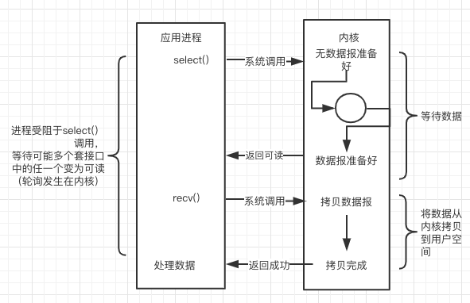

[原文链接](http://tutorials.jenkov.com/java-nio/index.html)

作者：Jakob Jenkov
# 什么是NIO
Java NIO（ New IO） 是从Java 1.4版本开始引入的一个新的IO API，可以替代标准的Java IO 和Java Networking API。NIO与原来的IO有同样的作用和目的，但是使用的方式完全不同， NIO支持面向缓冲区的、基于通道的IO操作。 NIO将以更加高效的方式进行文件的读写操作。
- Channels and Buffers（通道和缓冲区）：标准的IO基于字节流和字符流进行操作的，而NIO是基于通道（Channel）和缓冲区（Buffer）进行操作，数据总是从通道读取到缓冲区中，或者从缓冲区写入到通道中。
- Non-Blocking IO（非阻塞IO）：Java NIO可以让你非阻塞的使用IO，例如：当线程从通道读取数据到缓冲区时，线程还是可以进行其他事情。当数据被写入到缓冲区时，线程可以继续处理它。从缓冲区写入通道也类似。
- Selectors（选择器）：Java NIO引入了选择器的概念，选择器用于监听多个通道的事件（比如：连接打开，数据到达）。因此，单个的线程可以监听多个数据通道。

# NIO 概述
Java NIO 由以下几个核心部分组成
- Channels
- Buffers
- Selectors

虽然Java NIO 中除此之外还有很多类和组件，但在我看来，Channel，Buffer 和 Selector 构成了核心的API。其它组件，如Pipe和FileLock，只不过是与三个核心组件共同使用的工具类。因此，在概述中我将集中在这三个组件上。其它组件会在单独的章节中讲到。
## Channels and Buffers
基本上，所有的 IO 在NIO 中都从一个Channel 开始。Channel 有点象流。 数据可以从Channel读到Buffer中，也可以从Buffer 写到Channel中。这里有个图示：


Channel和Buffer有好几种类型。下面是JAVA NIO中的一些主要Channel的实现：
- FileChannel
- DatagramChannel
- SocketChannel
- ServerSocketChannel

正如你所看到的，这些通道涵盖了UDP 和 TCP 网络IO，以及文件IO。

与这些类一起的有一些有趣的接口，但为简单起见，我尽量在概述中不提到它们。本教程其它章节与它们相关的地方我会进行解释。

以下是Java NIO里关键的Buffer实现：
- ByteBuffer
- CharBuffer
- DoubleBuffer
- FloatBuffer
- IntBuffer
- LongBuffer
- ShortBuffer

这些Buffer覆盖了你能通过IO发送的基本数据类型：byte, short, int, long, float, double 和 char。

Java NIO 还有个 MappedByteBuffer，用于表示内存映射文件， 后面再聊。
## Selector
Selector允许单线程处理多个 Channel。如果你的应用打开了多个连接（通道），但每个连接的流量都很低，使用Selector就会很方便。例如，在一个聊天服务器中。

这是在一个单线程中使用一个Selector处理3个Channel的图示：


要使用Selector，得向Selector注册Channel，然后调用它的select()方法。这个方法会一直阻塞到某个注册的通道有事件就绪。一旦这个方法返回，线程就可以处理这些事件，事件的例子如：新连接进来，数据接收等。
# Java NIO Channel
通道表示打开到 IO 设备(例如：文件、套接字)的连接。若需要使用 NIO 系统，需要获取用于连接 IO 设备的通道以及用于容纳数据的缓冲区。然后操作缓冲区，对数据进行处理。Channel 负责传输， Buffer 负责存储。通道是由 java.nio.channels 包定义的。 Channel 表示 IO 源与目标打开的连接。Channel 类似于传统的“流”，但又有些不同：
- 既可以从通道中读取数据，又可以写数据到通道。但流的读写通常是单向的。
- 通道可以异步地读写。
- 通道中的数据总是要先读到一个Buffer，或者总是要从一个Buffer中写入（Channel 传输， Buffer 存储）。

## Channel 的实现类
这些是Java NIO中最重要的通道的实现：
- FileChannel：用于读取、写入、映射和操作文件的通道。
- DatagramChannel：通过 UDP 读写网络中的数据通道。
- SocketChannel：通过 TCP 读写网络中的数据。
- ServerSocketChannel：可以监听新进来的 TCP 连接，像Web服务器那样，对每一个新进来的连接都会创建一个 SocketChannel。

# Java NIO Buffer
Java NIO中的Buffer用于和NIO通道进行交互。如你所知，数据是从通道读入缓冲区，从缓冲区写入到通道中的。

缓冲区本质上是一块可以写入数据，然后可以从中读取数据的内存。这块内存被包装成NIO Buffer对象，并提供了一组方法，用来方便的访问该块内存

## Buffer 的基本用法
使用Buffer读写数据一般遵循以下四个步骤
1. 写入数据到 Buffer
2. 调用`flip()`方法
3. 从Buffer中读取数据
4. 调用`clear()`方法或者`compact()`方法

当向buffer写入数据时，buffer会记录下写了多少数据。一旦要读取数据，需要通过`flip()`方法将Buffer从写模式切换到读模式。在读模式下，可以读取之前写入到buffer的所有数据。

一旦读完了所有的数据，就需要清空缓冲区，让它可以再次被写入。有两种方式能清空缓冲区：调用`clear()`或`compact()`方法。`clear()`方法会清空整个缓冲区。`compact()`方法只会清除已经读过的数据。任何未读的数据都被移到缓冲区的起始处，新写入的数据将放到缓冲区未读数据的后面
```java
ByteSource source = provider.get();

  // 按字节读取
  try (var stream = source.openStream(); var channel = Channels.newChannel(stream);) {
     ByteBuffer buf = ByteBuffer.allocate(1024 * 1024); // 1MB
     int byteRead = -1;
     while ((byteRead = channel.read(buf)) != -1) {
        System.out.println("读取" + byteRead + "字节");
        buf.flip();
        while (buf.hasRemaining()) {
           System.out.print((char) buf.get());
        }
        buf.clear();
     }
  }

  // 按字符读取
  CharSource charSource = source.asCharSource(Charsets.UTF_8);
  try (var reader = charSource.openStream()) {
     CharBuffer buf = CharBuffer.allocate(1024 * 1024 / 2);// 1MB
     int charRead = -1;
     while ((charRead = reader.read(buf)) != -1) {
        System.out.println("读取" + charRead + "字符");
        buf.flip();
        while (buf.hasRemaining()) {
           System.out.print(buf.get());
        }
        buf.clear();
     }
  }
```
## Buffer Capacity, Position and Limit
为了理解Buffer的工作原理，需要熟悉它的三个属性
- capacity
- position
- limit

position和limit的含义取决于Buffer处在读模式还是写模式。不管Buffer处在什么模式，capacity是不会变的。这里有一个关于capacity，position和limit在读写模式中的说明


### capacity - 容量
作为一个内存块，Buffer有一个固定的大小值，也叫“capacity”.你只能往里写capacity个byte、long，char等类型。一旦Buffer满了，需要将其清空（通过读数据或者清除数据）才能继续写数据往里写数据。

### position - 当前位置
当你写数据到Buffer中时，position表示当前的位置。初始的position值为0.当一个byte、long等数据写到Buffer后， position会向前移动到下一个可插入数据的Buffer单元。position最大可为capacity – 1.

当读取数据时，也是从某个特定位置读。当将Buffer从写模式切换到读模式，position会被重置为0. 当从Buffer的position处读取数据时，position向前移动到下一个可读的位置。

### limit - 上限
在写模式下，Buffer的limit表示你最多能往Buffer里写多少数据。 在这个模式下，limit等于Buffer的capacity。

当切换Buffer到读模式时， limit表示你最多能读到多少数据。因此，当通过调用`flip`切换到读模式的时候 `limit = position of write mode` 换句话说，你能读到已经写入的所有数据（读模式的`limit`是由写模式的`position`决定的，两者相等）

## Buffer的类型
Java NIO 有以下Buffer类型
- ByteBuffer
- MappedByteBuffer
- CharBuffer
- DoubleBuffer
- FloatBuffer
- IntBuffer
- LongBuffer
- ShortBuffer

如你所见，这些Buffer类型代表了不同的数据类型。换句话说，就是可以通过char，short，int，long，float 或 double类型来操作缓冲区中的字节。MappedByteBuffer 有些特别，在涉及它的专门章节中再讲。

## Buffer的分配

要想获得一个Buffer对象首先要进行分配。 每一个Buffer类都有一个allocate方法。下面是一个分配48字节capacity的ByteBuffer的例子

```java
ByteBuffer buf = ByteBuffer.allocate(48);
```

这是分配一个可存储1024个字符的CharBuffer

```java
CharBuffer buf = CharBuffer.allocate(1024);
```
### 向Buffer中写数据

写数据到Buffer有两种方式

  1. 从Channel写到Buffer
  2. 通过Buffer的`put()`方法写到Buffer里

从Channel写到Buffer的例子

```java
int bytesRead = inChannel.read(buf); //read into buffer.
```

通过put方法写Buffer的例子

```java
buf.put(127);
```

put方法有很多版本，允许你以不同的方式把数据写入到Buffer中。例如， 写到一个指定的位置，或者把一个字节数组写入到Buffer

#### flip()方法
flip方法将Buffer从写模式切换到读模式。调用flip()方法会将position设回0，并将limit设置成之前position的值
换句话说，position现在用于标记读的位置，limit表示之前写进了多少个byte、char等。现在能读取多少个byte、char等

### 从Buffer中读取数据

从Buffer中读取数据
  1. 从Buffer读取数据到Channel
  2. 使用`get()`方法从Buffer中读取数据

从Buffer读取数据到Channel的例子

```java
int bytesWritten = inChannel.write(buf); // inChannel is a Writable channel
```

使用get()方法从Buffer中读取数据的例子

```java
byte aByte = buf.get();
```

get方法有很多版本，允许你以不同的方式从Buffer中读取数据。例如，从指定position读取，或者从Buffer中读取数据到字节数组

#### rewind()方法

Buffer.rewind()将position设回0，所以你可以重读Buffer中的所有数据。limit保持不变，仍然表示能从Buffer中读取多少个元素（byte、char等）

#### clear()与compact()方法

一旦读完Buffer中的数据，需要让Buffer准备好再次被写入。可以通过clear()或compact()方法来完成

如果调用的是clear()方法，position将被设回0，limit被设置成 capacity的值。换句话说，Buffer 被清空了。**Buffer中的数据并未清除，只是这些标记告诉我们可以从哪里开始往Buffer里写数据**

> compact - `ReadOnlyBufferException` If this buffer is read-only

如果Buffer中有一些未读的数据，调用clear()方法，数据将“被遗忘”，意味着不再有任何标记会告诉你哪些数据被读过，哪些还没有

如果Buffer中仍有未读的数据，且后续还需要这些数据，但是此时想要先向buffer写些数据，那么使用compact()方法

compact()方法将所有未读的数据拷贝到Buffer起始处。然后将position设到最后一个未读元素正后面。limit属性依然像clear()方法一样，设置成capacity。现在Buffer准备好写数据了，但是不会覆盖未读的数据

#### mark()与reset()方法

通过调用Buffer.mark()方法，可以标记Buffer中的一个特定position。之后可以通过调用Buffer.reset()方法恢复到这个position

```java
buffer.mark();

//call buffer.get() a couple of times, e.g. during parsing.

buffer.reset();  //set position back to mark.
```

### equals() and compareTo()

#### equals()

当满足下列条件时，表示两个Buffer相等

  - 有相同的类型（byte、char、int等）。
  - Buffer中剩余的byte、char等的个数相等。
  - Buffer中剩余的byte、char等都相同。

> 剩余元素是从 position到limit之间的元素。 所以和初始长度，大小无关

#### compareTo()方法

compareTo()方法比较两个Buffer的剩余元素(byte、char等)， 如果满足下列条件，则认为一个Buffer “小于” 另一个Buffer

  - 第一个不相等的元素小于另一个Buffer中对应的元素 。
  - 所有元素都相等，但第一个Buffer比另一个先耗尽(第一个Buffer的元素个数比另一个少)

---

# Scatter/Gather

Java NIO开始支持scatter/gather，scatter/gather用于描述从Channel（译者注：Channel在中文经常翻译为通道）中读取或者写入到Channel的操作

分散（scatter）从Channel中读取是指在读操作时将读取的数据写入多个buffer中。因此，Channel将从Channel中读取的数据“分散（scatter）”到多个Buffer中

聚集（gather）写入Channel是指在写操作时将多个buffer的数据写入同一个Channel，因此，Channel 将多个Buffer中的数据“聚集（gather）”后发送到Channel

scatter / gather经常用于需要将传输的数据分开处理的场合，例如传输一个由消息头和消息体组成的消息，你可能会将消息体和消息头分散到不同的buffer中，这样你可以方便的处理消息头和消息体

## Scattering Reads

Scattering Reads是指数据从一个channel读取到多个buffer中。如下图描述


注意buffer首先被插入到数组，然后再将数组作为channel.read() 的输入参数。read()方法按照buffer在数组中的顺序将从channel中读取的数据写入到buffer，当一个buffer被写满后，channel紧接着向另一个buffer中写

Scattering Reads在移动下一个buffer前，必须填满当前的buffer，这也意味着它不适用于动态消息(译者注：消息大小不固定)。换句话说，如果你有一个header和一个body,**header是固定大小**(比如，128个字节)。Scattering Reads才能正常工作

```Java
var header = new StringBuffer();
var body = new StringBuffer();
try (var file = new RandomAccessFile(yaml.getScatter(), "r");
      var channel = file.getChannel();) {
   var headerBuf = ByteBuffer.allocate(6);// fixed size
   var bodyBuf = ByteBuffer.allocate(1024);// the body size must be less than 1kb, otherwise it will mess up header and body
   ByteBuffer[] buffers = {headerBuf, bodyBuf};
   while (channel.read(buffers) != -1) {
      headerBuf.flip();
      while (headerBuf.hasRemaining()) {
         header.append((char) headerBuf.get());
      }
      headerBuf.clear();

      bodyBuf.flip();
      while (bodyBuf.hasRemaining()) {
         body.append((char) bodyBuf.get());
      }
      bodyBuf.clear();
   } ;
   logger.info("消息头为:" + header);
   logger.info("消息体为:" + body);
}
```


## Gathering Writes

Gathering Writes是指数据从多个buffer写入到同一个channel。如下图描述


buffers数组是write()方法的入参，write()方法会按照buffer在数组中的顺序，将数据写入到channel，注意只有position和limit之间的数据才会被写入。因此，如果一个buffer的容量为128byte，但是仅仅包含58byte的数据，那么这58byte的数据将被写入到channel中。因此与Scattering Reads相反，Gathering Writes能较好的处理动态消息

```Java
try (var file = new RandomAccessFile(yaml.getScatter(), "r");
      var channel = file.getChannel();
      var targetFile = new RandomAccessFile(yaml.getGather(), "rw");
      var targetChannel = targetFile.getChannel();) {
  ByteBuffer[] buffers =
       {ByteBuffer.allocate(4), ByteBuffer.allocate(5), ByteBuffer.allocate(6)};
  while (channel.read(buffers) != -1) {
    for (var i = 0; i < buffers.length; i++) {
       buffers[i].flip();
    }
    targetChannel.write(buffers);
    for (var i = 0; i < buffers.length; i++) {
       buffers[i].clear();
    }
  }
  }
}
```


---

# Java NIO FileChannel

> A FileChannel cannot be set into non-blocking mode. It always runs in blocking mode.

使用FileChannel配合缓冲区（非直接缓冲区）实现文件复制的功能

```Java
try (
  var source = FileChannel.open(Paths.get(yaml.getFrom()), StandardOpenOption.READ);
  var sink = FileChannel.open(Paths.get(yaml.getTo()), Sets.newHashSet(StandardOpenOption.WRITE, StandardOpenOption.READ, StandardOpenOption.CREATE));) {
  var buffer = ByteBuffer.allocate(1024*1024); // 1MB
  while(source.read(buffer) != -1) {
    buffer.flip();//read mode
    sink.write(buffer);
    buffer.clear();
  }
}
```

## 直接与非直接缓冲区

  - 非直接缓冲区是需要经过一个：copy的阶段的(从内核空间copy到用户空间)
  - 直接缓冲区不需要经过copy阶段，也可以理解成--->内存映射文件
  - 字节缓冲区要么是直接的，要么是非直接的。如果为直接字节缓冲区，则 Java 虚拟机会尽最大努力直接在机此缓冲区上执行本机 I/O 操作。也就是说，在每次调用基础操作系统的一个本机 I/O 操作之前（或之后），虚拟机都会尽量避免将缓冲区的内容复制到中间缓冲区中（或从中间缓冲区中复制内容）
  - 直接字节缓冲区可以通过调用此类的 `allocateDirect()` 工厂方法 来创建。此方法返回的 缓冲区进行分配和取消分配所需成本通常高于非直接缓冲区 。直接缓冲区的内容可以驻留在常规的垃圾回收堆之外，因此，它们对应用程序的内存需求量造成的影响可能并不明显。所以，建议将直接缓冲区主要分配给那些易受基础系统的机 本机 I/O 操作影响的大型、持久的缓冲区。一般情况下，最好仅在直接缓冲区能在程序性能方面带来明显好处时分配它们
  - 直接字节缓冲区还可以过通过`FileChannel`的`map`方法将文件区域直接映射到内存中创建。该方法返回`MappedByteBuffer`。Java 平台的实现有助于通过 JNI 从本机代码创建直接字节缓冲区。如果以上这些缓冲区中的某个缓冲区实例指的是不可访问的内存区域，则试图访问该区域不会更改该缓冲区的内容，并且将会在访问期间或稍后的某个时间导致抛出不确定的异常
  - 字节缓冲区是直接缓冲区还是非直接缓冲区可通过调用其 `isDirect()` 方法来确定。提供此方法是为了能够在性能关键型代码中执行显式缓冲区管理
  - 非直接缓冲区将内存建立在jvm缓存中（`allocate`方法）。直接缓冲区将内存建立在操作系统的物理内存中（`allocateDirect`方法）

**非直接缓冲区**


**直接缓冲区**


使用内存映射文件的方式实现文件复制的功能(直接操作缓冲区)：

```java
try (
  var source = FileChannel.open(Paths.get(from), StandardOpenOption.READ);
  var sink = FileChannel.open(Paths.get(to), Sets.newHashSet(StandardOpenOption.WRITE, StandardOpenOption.READ, StandardOpenOption.CREATE));) {
  var buffer = source.map(MapMode.READ_ONLY, 0, source.size());
  while (buffer.hasRemaining()) {
    sink.write(buffer);
  }
}
```

## Java NIO Channel to Channel Transfers

在Java NIO中，如果两个通道中有一个是FileChannel，那你可以直接将数据从一个channel传输到另外一个channel

### transferFrom

FileChannel的transferFrom()方法可以将数据从源通道传输到FileChannel中（译者注：这个方法在JDK文档中的解释为将字节从给定的可读取字节通道传输到此通道的文件中）。下面是一个简单的例子

```Java
try (
  var source = FileChannel.open(Paths.get(yaml.getRead()), StandardOpenOption.READ);
  var sink = FileChannel.open(Paths.get(yaml.getGather()), StandardOpenOption.WRITE);) {
    long position = 0;
    long count = source.size();
    sink.transferFrom(source, position, count);
}
```

方法的输入参数position表示从position处开始向目标文件写入数据，count表示最多传输的字节数。**如果源通道的剩余空间小于 count 个字节，则所传输的字节数要小于请求的字节数**

> 此外要注意，在SoketChannel的实现中，SocketChannel只会传输此刻准备好的数据（可能不足count字节）。因此，SocketChannel可能不会将请求的所有数据(count个字节)全部传输到FileChannel中

### transferTo

transferTo()方法将数据从FileChannel传输到其他的channel中。下面是一个简单的例子

```java
try (
  var source = FileChannel.open(Paths.get(yaml.getRead()), StandardOpenOption.READ);
  var sink = FileChannel.open(Paths.get(yaml.getGather()), StandardOpenOption.WRITE);) {
    long position = 0;
    long count = source.size();
    source.transferTo(position, count, sink);
}
```

### 2G上限
transferTo源码里面指定了2G上限
```Java
int icount = (int)Math.min(count, Integer.MAX_VALUE); // 2G
```
所以如果处理超过2GB的文件就要循环执行transferTo方法,直至处理长度和文件长度一样为止

---

# IO模型理解

根据UNIX网络编程对I/O模型的分类，在UNIX可以归纳成5种I/O模型

  - 阻塞I/O
  - 非阻塞I/O
  - I/O多路复用
  - 信号驱动I/O
  - 异步I/O

## 文件描述符

Linux 的内核将所有外部设备都看做一个文件来操作，对一个文件的读写操作会调用内核提供的系统命令(api)，返回一个file descriptor（fd，文件描述符）。而对一个socket的读写也会有响应的描述符，称为socket fd（socket文件描述符），描述符就是一个数字，指向内核中的一个结构体（文件路径，数据区等一些属性）

## 用户空间和内核空间

为了保证用户进程不能直接操作内核（kernel），保证内核的安全，操心系统将虚拟空间划分为两部分
  - 内核空间
  - 用户空间

## I/O运行过程

我们来看看IO在系统中的运行是怎么样的(我们以read为例)


可以发现的是：当应用程序调用read方法时，是需要等待的--->从内核空间中找数据，再将内核空间的数据拷贝到用户空间的.这个等待是必要的过程

### 阻塞I/O模型

在进程(用户)空间中调用recvfrom，其系统调用直到数据包到达且被复制到应用进程的缓冲区中或者发生错误时才返回，在此期间一直等待

例子：
Java3y跟女朋友去买喜茶，排了很久的队终于可以点饮料了。我要绿研，谢谢。可是喜茶不是点了单就能立即拿，于是我在喜茶门口等了一小时才拿到绿研（在门口干等一小时）


### 非阻塞I/O模型

recvfrom从应用层到内核的时候，如果没有数据就直接返回一个EWOULDBLOCK错误，一般都对非阻塞I/O模型进行轮询检查这个状态，看内核是不是有数据到来

例子：
Java3y跟女朋友去买一点点，排了很久的队终于可以点饮料了。我要波霸奶茶，谢谢。可是一点点不是点了单就能立即拿，同时服务员告诉我：你大概要等半小时哦。你们先去逛逛吧~于是Java3y跟女朋友去玩了几把斗地主，感觉时间差不多了。于是又去一点点问：请问到我了吗？我的单号是xxx。服务员告诉Java3y：还没到呢，现在的单号是XXX，你还要等一会，可以去附近耍耍。问了好几次后，终于拿到我的波霸奶茶了（去逛了下街、斗了下地主，时不时问问到我了没有）


### I/O复用模型

在Linux下对文件的操作是利用文件描述符(file descriptor)来实现的：调用select/poll/epoll/pselect其中一个函数，传入多个文件描述符，如果有一个文件描述符就绪，则返回，否则阻塞直到超时

例子：
Java3y跟女朋友去麦当劳吃汉堡包，现在就厉害了可以使用微信小程序点餐了。于是跟女朋友找了个地方坐下就用小程序点餐了。点餐了之后玩玩斗地主、聊聊天什么的。时不时听到广播在复述XXX请取餐，反正我的单号还没到，就继续玩呗。~~等听到广播的时候再取餐就是了。时间过得挺快的，此时传来：Java3y请过来取餐。于是我就能拿到我的麦辣鸡翅汉堡了（听广播取餐，广播不是为我一个人服务。广播喊到我了，我过去取就Ok了）




  - 当用户进程调用了select，那么整个进程会被block；
  - 而同时，kernel会“监视”所有select负责的socket；
  - 当任何一个socket中的数据准备好了，select就会返回；
  - 这个时候用户进程再调用read操作，将数据从kernel拷贝到用户进程(空间)。

所以，I/O 多路复用的特点是通过一种机制一个进程能同时等待多个文件描述符，而这些文件描述符其中的任意一个进入读就绪状态，select()函数就可以返回

> select/epoll的优势并不是对于单个连接能处理得更快，而是在于能处理更多的连接

#### I/O 多路复用- select


有连接请求抵达了再检查处理。

 - 句柄上限- 默认打开的FD有限制,1024个。
 - 重复初始化-每次调用 select()，需要把 fd 集合从用户态拷贝到内核态，**内核进行遍历**。
 - 逐个排查所有FD状态效率不高

服务端的select 就像一块布满插口的插排，client端的连接连上其中一个插口，建立了一个通道，然后再在通道依次注册读写事件。一个就绪、读或写事件处理时一定记得删除，要不下次还能处理

#### I/O 多路复用 – epoll

上面 select 函数还是有问题的，因为每次 Socket 所在的文件描述符集合中有 Socket 发生变化的时候，都需要通过轮询的方式(内核态)，也就是需要将全部项目都过一遍的方式来查看进度，这大大影响了一个线程够支撑的最大的 Socket 数量。因而使用 select，能够同时盯的 Socket 数量由 FD_SETSIZE 限制

如果改成事件通知的方式，情况就会好很多，不需要通过轮询挨个盯着这些Socket，而是当Socket文件描述符发生变化的时候，主动通知，然后做相应的操作。能完成这件事情的函数叫 epoll，它在内核中的实现不是通过轮询的方式，而是通过注册 callback 函数的方式，当某个文件描述符发送变化的时候，就会主动通知


假设进程打开了 Socket m, n, x 等多个文件描述符，现在需要通过 epoll 来监听是否这些 Socket 都有事件发生。其中 epoll_create 创建一个 epoll 对象，也是一个文件，也对应一个文件描述符，同样也对应着打开文件列表中的一项。在这项里面有一个红黑树，在红黑树里，要保存这个 epoll 要监听的所有 Socket。当 epoll_ctl 添加一个 Socket 的时候，其实是加入这个红黑树，同时红黑树里面的节点指向一个结构，将这个结构挂在被监听的 Socket 的事件列表中。当一个 Socket 来了一个事件的时候，可以从这个列表中得到 epoll 对象，并调用 call back 通知它。这种通知方式使得监听的 Socket 数据增加的时候，效率不会大幅度降低，能够同时监听的 Socket 的数目也非常的多了。上限就为系统定义的、进程打开的最大文件描述符个数。因而，epoll 被称为解决 C10K 问题的利器

### 信号驱动IO模型

通过调用sigaction注册信号函数，等内核数据准备好的时候系统中断当前程序，执行信号函数(在这里面调用recv)


### 异步IO模型

调用aio_read，让内核等数据准备好，并且复制到用户进程空间后执行事先指定好的函数


### 总结
 - 同步/异步，连接建立后，用户程序读写时，如果最终还是需要用户程序来调用系统read()来读数据，那就是同步的，反之是异步。Windows实现了真正的异步，内核代码甚为复杂，但对用户程序来说是透明的。

 - 阻塞/非阻塞，连接建立后，用户程序在等待可读可写时，是不是可以干别的事儿。如果可以就是非阻塞，反之阻塞。大多数操作系统都支持的。
---

# Selector

Selector（选择器）是Java NIO中能够检测一到多个NIO通道，并能够知晓通道是否为诸如读写事件做好准备的组件。这样，一个单独的线程可以管理多个channel，从而管理多个网络连接

## 为什么使用Selector?

仅用单个线程来处理多个Channels的好处是，只需要更少的线程来处理通道。事实上，可以只用一个线程处理所有的通道。对于操作系统来说，线程之间上下文切换的开销很大，而且每个线程都要占用系统的一些资源（如内存）。因此，使用的线程越少越好。

但是，需要记住，现代的操作系统和CPU在多任务方面表现的越来越好，所以多线程的开销随着时间的推移，变得越来越小了。实际上，如果一个CPU有多个内核，不使用多任务可能是在浪费CPU能力。不管怎么说，关于那种设计的讨论应该放在另一篇不同的文章中。在这里，只要知道使用Selector能够处理多个通道就足够了。

下面是单线程使用一个Selector处理3个channel的示例图


## Selector的创建

通过调用Selector.open()方法创建一个Selector

```Java
Selector selector = Selector.open();
```

## Registering Channels with the Selector

为了将Channel和Selector配合使用，必须将channel注册到selector上。通过SelectableChannel.register()方法来实现，如下

```Java
channel.configureBlocking(false);
SelectionKey key = channel.register(selector, Selectionkey.OP_READ);
```

与Selector一起使用时，Channel**必须处于非阻塞模式下**。这意味着不能将FileChannel与Selector一起使用，因为FileChannel不能切换到非阻塞模式。而套接字通道`Socket channels`可以

Notice the second parameter of the `register()` method. This is an "interest set", meaning what events you are interested in listening for in the Channel, via the Selector. There are four different events you can listen for

  1. Connect
  2. Accept
  3. Read
  4. Write

通道触发了一个事件意思是该事件已经就绪。所以，某个channel成功连接到另一个服务器称为"连接就绪-connect"。一个server socket channel准备好接收新进入的连接称为"接收就绪-accept"。一个有数据可读的通道可以说是"读就绪-read"。等待写数据的通道可以说是"写就绪-write". 这四种事件用SelectionKey的四个常量来表示

  1. SelectionKey.OP_CONNECT
  2. SelectionKey.OP_ACCEPT
  3. SelectionKey.OP_READ
  4. SelectionKey.OP_WRITE

If you are interested in more than one event, OR the constants together, like this:

```java
int interestSet = SelectionKey.OP_READ | SelectionKey.OP_WRITE;    
```

## java.nio.channels.SelectionKey

在上一小节中，当向Selector注册Channel时，register()方法会返回一个SelectionKey对象。这个对象包含了一些你感兴趣的属性

  - The interest set
  - The ready set
  - The Channel
  - The Selector
  - An attached object (optional)

### Interest Set

interest集合是你所选择的感兴趣的事件集合。可以通过SelectionKey读写interest集合

```Java
int interestSet = selectionKey.interestOps();
boolean isInterestedInAccept  = interestSet & SelectionKey.OP_ACCEPT;
boolean isInterestedInConnect = interestSet & SelectionKey.OP_CONNECT;
boolean isInterestedInRead    = interestSet & SelectionKey.OP_READ;
boolean isInterestedInWrite   = interestSet & SelectionKey.OP_WRITE;    
```

可以看到，用"位与"操作interest 集合和给定的SelectionKey常量，可以确定某个确定的事件是否在interest 集合中

### Ready Set

The ready set is the set of operations the channel is ready for. You will primarily be accessing the ready set after a selection

```Java
int readySet = selectionKey.readyOps();
```

可以用像检测interest集合那样的方法，来检测channel中什么事件或操作已经就绪. 或者，也可以使用以下四个方法，它们都会返回一个布尔类型

```Java
selectionKey.isAcceptable();
selectionKey.isConnectable();
selectionKey.isReadable();
selectionKey.isWritable();
```

### Channel + Selector

从SelectionKey访问Channel和Selector很简单

```Java
Channel  channel  = selectionKey.channel();
Selector selector = selectionKey.selector();    
```

### Attaching Objects

You can attach an object to a SelectionKey this is a handy way of recognizing a given channel, or attaching further information to the channel. For instance, you may attach the Buffer you are using with the channel, or an object containing more aggregate data. 需要注意的是如果附加的对象不再使用，一定要人为清除，因为垃圾回收器不会回收该对象，若不清除的话会成内存泄漏.一个单独的通道可被注册到多个选择器中，有些时候我们需要通过`isRegistered`方法来检查一个通道是否已经被注册到任何一个选择器上。 通常来说，我们并不会这么做

```Java
selectionKey.attach(theObject);
Object attachedObj = selectionKey.attachment();
```

还可以在用register()方法向Selector注册Channel的时候附加对象:

```java
SelectionKey key = channel.register(selector, SelectionKey.OP_READ, theObject);
```

## Selecting Channels via a Selector

一旦向Selector注册了一或多个通道，就可以调用几个重载的select()方法。这些方法返回你所感兴趣的事件（如连接、接受、读或写）已经准备就绪的那些通道。换句话说，如果你对“读就绪”的通道感兴趣，select()方法会返回读事件已经就绪的那些通道

```Java
int select()
int select(long timeout)
int selectNow()
```

  - `select()` blocks until at least one channel is ready for the events you registered for

  - `select(long timeout)` does the same as select() except it blocks for a maximum of timeout milliseconds (the parameter).

  - `selectNow() `doesn't block at all. It returns immediately with whatever channels are ready(此方法执行非阻塞的选择操作。如果自从前一次选择操作后，没有通道变成可选择的，则此方法直接返回零)

```Java
/*
Selects a set of keys whose corresponding channels are ready for I/O operations.
This method performs a non-blocking selection operation. If no channels have become selectable since the previous selection operation then this method immediately returns zero.

Invoking this method clears the effect of any previous invocations of the wakeup method.
*/
public abstract int selectNow() throws IOException;
```

select()方法返回的int值表示有多少通道已经就绪。亦即，自上次调用select()方法后有多少通道变成就绪状态。如果调用select()方法，因为有一个通道变成就绪状态，返回了1，若再次调用select()方法，如果另一个通道就绪了，它会再次返回1。如果对第一个就绪的channel没有做任何操作，现在就有两个就绪的通道，但在每次select()方法调用之间，只有一个通道就绪了

### selectedKeys()

Once you have called one of the select() methods and its return value has indicated that one or more channels are ready, you can access the ready channels via the "selected key set", by calling the selectors selectedKeys() method

```Java
Set<SelectionKey> selectedKeys = selector.selectedKeys();
```

When you register a channel with a Selector the Channel.register() method returns a SelectionKey object. This key represents that channels registration with that selector. It is these keys you can access via the `selectedKeys()` method

You can iterate this selected key set to access the ready channels. Here is how that looks:

```Java
Set<SelectionKey> selectedKeys = selector.selectedKeys();

Iterator<SelectionKey> keyIterator = selectedKeys.iterator();

while(keyIterator.hasNext()) {

  SelectionKey key = keyIterator.next();

  if(key.isAcceptable()) {
      // a connection was accepted by a ServerSocketChannel.

  } else if (key.isConnectable()) {
      // a connection was established with a remote server.

  } else if (key.isReadable()) {
      // a channel is ready for reading

  } else if (key.isWritable()) {
      // a channel is ready for writing
  }

  keyIterator.remove();
}
```

> 注意每次迭代末尾的keyIterator.remove()调用。Selector不会自己从已选择键集中移除SelectionKey实例。必须在处理完通道时自己移除。下次该通道变成就绪时，Selector会再次将其放入已选择键集中

SelectionKey.channel()方法返回的通道需要转型成你要处理的类型，如ServerSocketChannel或SocketChannel等

### wakeUp()

某个线程调用select()方法后阻塞了，即使没有通道已经就绪，也有办法让其从select()方法返回。只要让其它线程在第一个线程调用select()方法的`Selector`对象上调用Selector.wakeup()方法即可。阻塞在select()方法上的线程会立马返回

### close()

用完Selector后调用其close()方法会关闭该Selector，且使注册到该Selector上的所有SelectionKey实例无效。通道本身并不会关闭

---

# Java NIO Pipe

Java NIO 管道是2个线程之间的**单向**数据连接。Pipe有一个source通道和一个sink通道。数据会被写到sink通道，从source通道读取。

这里是Pipe原理的图示：


## 创建管道

通过Pipe.open()方法打开管道

```java
Pipe pipe = Pipe.open();
```

### 向管道写数据

要向管道写数据，需要访问sink通道。像这样

```Java
Pipe.SinkChannel sinkChannel = pipe.sink();
```

通过调用SinkChannel的write()方法，将数据写入SinkChannel,像这样

```Java
String newData = "New String to write to file..." + System.currentTimeMillis();

ByteBuffer buf = ByteBuffer.allocate(48);
buf.clear();
buf.put(newData.getBytes());

buf.flip();

while(buf.hasRemaining()) {
    sinkChannel.write(buf);
}
```

### 从管道读取数据

从读取管道的数据，需要访问source通道，像这样

```Java
Pipe.SourceChannel sourceChannel = pipe.source();
```

调用source通道的read()方法来读取数据，像这样

```java
ByteBuffer buf = ByteBuffer.allocate(48);
int bytesRead = sourceChannel.read(buf);
```

read()方法返回的int值会告诉我们多少字节被读进了缓冲区

> Pipe的更多意义在于多线程分别操作source,sink以及Selector.

### 结合Selector

从源码看到，pipe的SourceChannel、SinkChannel都继承了`AbstractSelectableChannel`类，所以说pipe可以实现多路复用

---

