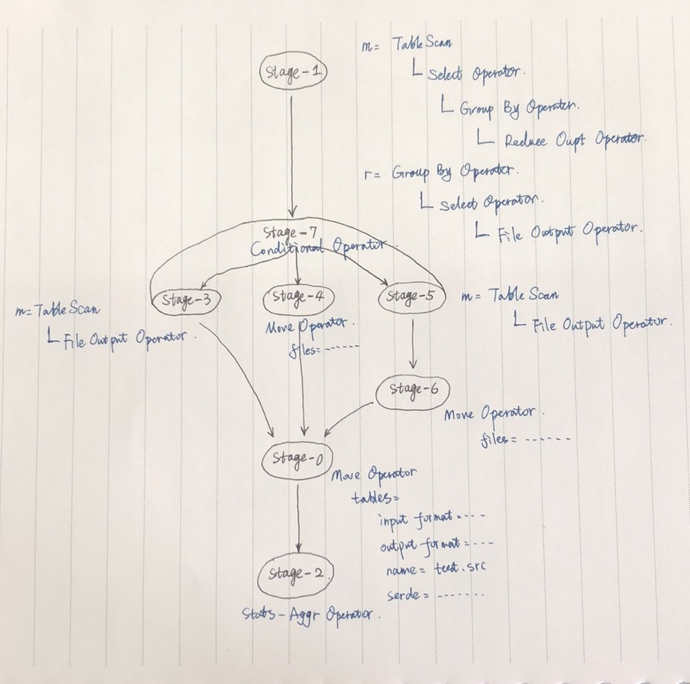

What is a SerDe?

  - SerDe is a short name for "Serializer and Deserializer."
  - Hive uses SerDe (and FileFormat) to read and write table rows.
  - HDFS files --> InputFileFormat --> <key, value> --> Deserializer --> Row object
  - Row object --> Serializer --> <key, value> --> OutputFileFormat --> HDFS files


# EXPLAIN Syntax

Hive provides an EXPLAIN command that shows the execution plan for a query. The syntax for this statement is as follows:

```sql
EXPLAIN [EXTENDED|CBO|AST|DEPENDENCY|AUTHORIZATION|LOCKS|VECTORIZATION|ANALYZE] query
```

>AST was removed from EXPLAIN EXTENDED in HIVE-13533 and reinstated as a separate command in [HIVE-15932](https://issues.apache.org/jira/browse/HIVE-15932).

The use of EXTENDED in the EXPLAIN statement produces extra information about the operators in the plan. This is typically physical information like file names.

A Hive query gets converted into a sequence (it is more a Directed Acyclic Graph) of stages. These stages may be map/reduce stages or they may even be stages that do metastore or file system operations like move and rename. The explain output has three parts:

- The Abstract Syntax Tree for the query
- The dependencies between the different stages of the plan
- The description of each of the stages

The description of the stages itself shows a sequence of operators with the metadata associated with the operators. The metadata may comprise things like filter expressions for the FilterOperator or the select expressions for the SelectOperator or the output file names for the FileSinkOperator.

**Example**

```sql
EXPLAIN INSERT OVERWRITE TABLE test.src SELECT t.lsbh, sum(substr(t.edatu,4)) from ods.myzx_t_qxxsdd_h t where par_month='201901' GROUP BY t.lsbh;
```

The output of this statement contains the following parts:

The Dependency Graph

```sql
+-----------------------------------------------------------------------------------------------------------------------------------------------------------------------------+--+
| STAGE DEPENDENCIES:                                                                                                                                                         |
|   Stage-1 is a root stage                                                                                                                                                   |
|   Stage-7 depends on stages: Stage-1 , consists of Stage-4, Stage-3, Stage-5                                                                                                |
|   Stage-4                                                                                                                                                                   |
|   Stage-0 depends on stages: Stage-4, Stage-3, Stage-6                                                                                                                      |
|   Stage-2 depends on stages: Stage-0                                                                                                                                        |
|   Stage-3                                                                                                                                                                   |
|   Stage-5                                                                                                                                                                   |
|   Stage-6 depends on stages: Stage-5                                                                                                                                        |
```

This shows that Stage-1 is the root stage, Stage-7 is executed after Stage-1 is done and Stage-2 is the final stage.

The plans of each Stage

```sql
| STAGE PLANS:                                                                                                                                                                |
|   Stage: Stage-1                                                                                                                                                            |
|     Map Reduce                                                                                                                                                              |
|       Map Operator Tree:                                                                                                                                                    |
|           TableScan                                                                                                                                                         |
|             alias: t                                                                                                                                                        |
|             Statistics: Num rows: 194779 Data size: 18698784 Basic stats: COMPLETE Column stats: COMPLETE                                                                   |
|             Select Operator                                                                                                                                                 |
|               expressions: lsbh (type: int), substr(edatu, 4) (type: string)                                                                                                |
|               outputColumnNames: _col0, _col1                                                                                                                               |
|               Statistics: Num rows: 194779 Data size: 18698784 Basic stats: COMPLETE Column stats: COMPLETE                                                                 |
|               Group By Operator                                                                                                                                             |
|                 aggregations: sum(_col1)                                                                                                                                    |
|                 keys: _col0 (type: int)                                                                                                                                     |
|                 mode: hash                                                                                                                                                  |
|                 outputColumnNames: _col0, _col1                                                                                                                             |
|                 Statistics: Num rows: 97389 Data size: 1168668 Basic stats: COMPLETE Column stats: COMPLETE                                                                 |
|                 Reduce Output Operator                                                                                                                                      |
|                   key expressions: _col0 (type: int)                                                                                                                        |
|                   sort order: +                                                                                                                                             |
|                   Map-reduce partition columns: _col0 (type: int)                                                                                                           |
|                   Statistics: Num rows: 97389 Data size: 1168668 Basic stats: COMPLETE Column stats: COMPLETE                                                               |
|                   value expressions: _col1 (type: double)                                                                                                                   |
|       Reduce Operator Tree:                                                                                                                                                 |
|         Group By Operator                                                                                                                                                   |
|           aggregations: sum(VALUE._col0)                                                                                                                                    |
|           keys: KEY._col0 (type: int)                                                                                                                                       |
|           mode: mergepartial                                                                                                                                                |
|           outputColumnNames: _col0, _col1                                                                                                                                   |
|           Statistics: Num rows: 97389 Data size: 1168668 Basic stats: COMPLETE Column stats: COMPLETE                                                                       |
|           Select Operator                                                                                                                                                   |
|             expressions: _col0 (type: int), UDFToString(_col1) (type: string)                                                                                               |
|             outputColumnNames: _col0, _col1                                                                                                                                 |
|             Statistics: Num rows: 97389 Data size: 18309132 Basic stats: COMPLETE Column stats: COMPLETE                                                                    |
|             File Output Operator                                                                                                                                            |
|               compressed: true                                                                                                                                              |
|               Statistics: Num rows: 97389 Data size: 18309132 Basic stats: COMPLETE Column stats: COMPLETE                                                                  |
|               table:                                                                                                                                                        |
|                   input format: org.apache.hadoop.mapred.TextInputFormat                                                                                                    |
|                   output format: org.apache.hadoop.hive.ql.io.HiveIgnoreKeyTextOutputFormat                                                                                 |
|                   serde: org.apache.hadoop.hive.serde2.lazy.LazySimpleSerDe                                                                                                 |
|                   name: test.src                                                                                                                                            |
|                                                                                                                                                                             |
|   Stage: Stage-7                                                                                                                                                            |
|     Conditional Operator                                                                                                                                                    |
|                                                                                                                                                                             |
|   Stage: Stage-4                                                                                                                                                            |
|     Move Operator                                                                                                                                                           |
|       files:                                                                                                                                                                |
|           hdfs directory: true                                                                                                                                              |
|           destination: hdfs://emr-header-1.cluster-100513:9000/user/hive/warehouse/test.db/src/.hive-staging_hive_2019-11-14_16-46-19_209_6155966351382285063-3/-ext-10000  |
|                                                                                                                                                                             |
|   Stage: Stage-0                                                                                                                                                            |
|     Move Operator                                                                                                                                                           |
|       tables:                                                                                                                                                               |
|           replace: true                                                                                                                                                     |
|           table:                                                                                                                                                            |
|               input format: org.apache.hadoop.mapred.TextInputFormat                                                                                                        |
|               output format: org.apache.hadoop.hive.ql.io.HiveIgnoreKeyTextOutputFormat                                                                                     |
|               serde: org.apache.hadoop.hive.serde2.lazy.LazySimpleSerDe                                                                                                     |
|               name: test.src                                                                                                                                                |
|                                                                                                                                                                             |
|   Stage: Stage-2                                                                                                                                                            |
|     Stats-Aggr Operator                                                                                                                                                     |
|                                                                                                                                                                             |
|   Stage: Stage-3                                                                                                                                                            |
|     Map Reduce                                                                                                                                                              |
|       Map Operator Tree:                                                                                                                                                    |
|           TableScan                                                                                                                                                         |
|             File Output Operator                                                                                                                                            |
|               compressed: true                                                                                                                                              |
|               table:                                                                                                                                                        |
|                   input format: org.apache.hadoop.mapred.TextInputFormat                                                                                                    |
|                   output format: org.apache.hadoop.hive.ql.io.HiveIgnoreKeyTextOutputFormat                                                                                 |
|                   serde: org.apache.hadoop.hive.serde2.lazy.LazySimpleSerDe                                                                                                 |
|                   name: test.src                                                                                                                                            |
|                                                                                                                                                                             |
|   Stage: Stage-5                                                                                                                                                            |
|     Map Reduce                                                                                                                                                              |
|       Map Operator Tree:                                                                                                                                                    |
|           TableScan                                                                                                                                                         |
|             File Output Operator                                                                                                                                            |
|               compressed: true                                                                                                                                              |
|               table:                                                                                                                                                        |
|                   input format: org.apache.hadoop.mapred.TextInputFormat                                                                                                    |
|                   output format: org.apache.hadoop.hive.ql.io.HiveIgnoreKeyTextOutputFormat                                                                                 |
|                   serde: org.apache.hadoop.hive.serde2.lazy.LazySimpleSerDe                                                                                                 |
|                   name: test.src                                                                                                                                            |
|                                                                                                                                                                             |
|   Stage: Stage-6                                                                                                                                                            |
+-----------------------------------------------------------------------------------------------------------------------------------------------------------------------------+--+
|                                                                                   Explain                                                                                   |
+-----------------------------------------------------------------------------------------------------------------------------------------------------------------------------+--+
|     Move Operator                                                                                                                                                           |
|       files:                                                                                                                                                                |
|           hdfs directory: true                                                                                                                                              |
|           destination: hdfs://emr-header-1.cluster-100513:9000/user/hive/warehouse/test.db/src/.hive-staging_hive_2019-11-14_16-46-19_209_6155966351382285063-3/-ext-10000  |
|                                                                                                                                                                             |
+-----------------------------------------------------------------------------------------------------------------------------------------------------------------------------+--+
```



Basic operators are:
  - TableScanOperator
  - SelectOperator
  - FilterOperator
  - JoinOperator
  - GroupByOperator
  - ReduceSinkOperator

Sort order indicates the number of columns in key expressions that are used for sorting. Each "+" represents one column sorted in ascending order, and each "-" represents a column sorted in descending order.

A map/reduce stage itself has 2 parts:

  - A mapping from table alias to Map Operator Tree – This mapping tells the mappers which operator tree to call in order to process the rows from a particular table or result of a previous map/reduce stage. In Stage-1 in the above example, the rows from ods.myzx_t_qxxsdd_h table are processed by the operator tree rooted at a Reduce Output Operator. Similarly, in other stages the rows of the results of Stage-1 are processed by another operator tree rooted at another Reduce Output Operator. Each of these Reduce Output Operators partitions the data to the reducers according to the criteria shown in the metadata.

  - A Reduce Operator Tree – This is the operator tree which processes all the rows on the reducer of the map/reduce job. In Stage-1 for example, the Reducer Operator Tree is carrying out a partial aggregation whereas the Reducer Operator Tree in other stages computes the final aggregation from the partial aggregates computed in Stage-1


## The CBO Clause
