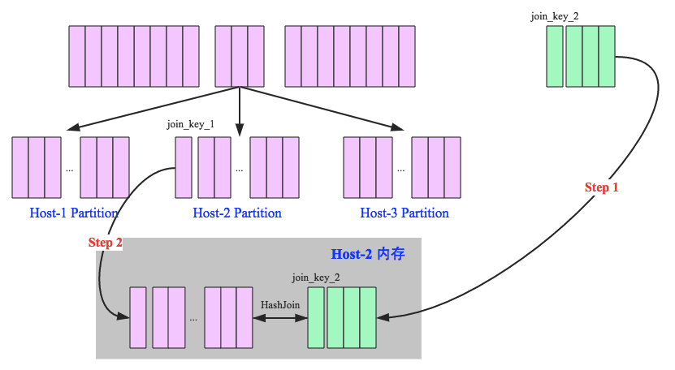
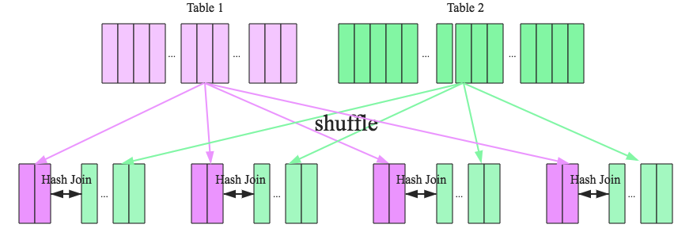
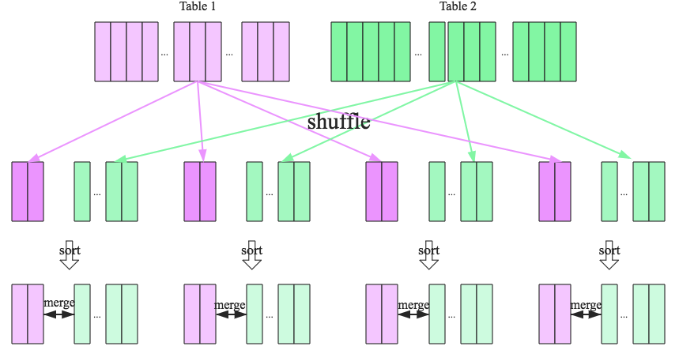
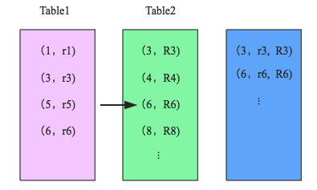

# 分布式Join方法

## Broadcast Hash Join

  1. broadcast阶段：将小表广播分发到大表所在的所有主机。广播算法可以有很多，最简单的是先发给driver，driver再统一分发给所有executor；要不就是基于bittorrete的p2p思路
  2. hash join阶段：在每个executor上执行单机版hash join，小表映射，大表试探



broadcast hash join执行的基本条件为被广播小表必须小于某个数值

## Shuffle Hash Join

在大数据条件下如果一张表很小，执行join操作最优的选择无疑是broadcast hash join，效率最高。但是一旦小表数据量增大，广播所需内存、带宽等资源必然就会太大，broadcast hash join就不再是最优方案。此时可以按照join key进行分区，根据key相同必然分区相同的原理，就可以将大表join分而治之，划分为很多小表的join，充分利用集群资源并行化。如下图所示，shuffle hash join也可以分为两步：

  1. shuffle阶段：分别将两个表按照join key进行分区，将相同join key的记录重分布到同一节点，两张表的数据会被重分布到集群中所有节点。这个过程称为shuffle
  2. hash join阶段：每个分区节点上的数据单独执行单机hash join算法



看到这里，可以初步总结出来如果两张小表join可以直接使用单机版hash join；如果一张大表join一张极小表，可以选择broadcast hash join算法；而如果是一张大表join一张小表，则可以选择shuffle hash join算法；那如果是两张大表进行join呢？

## Sort-Merge Join

SparkSQL对两张大表join采用了全新的算法－sort-merge join，如下图所示，整个过程分为三个步骤



  1. shuffle阶段：将两张大表根据join key进行重新分区，两张表数据会分布到整个集群，以便分布式并行处理

  2. sort阶段：对单个分区节点的两表数据，分别进行排序

  3. merge阶段：对排好序的两张分区表数据执行join操作。join操作很简单，分别遍历两个有序序列，碰到相同join key就merge输出，否则取更小一边，见下图示意

  


仔细分析的话会发现，sort-merge join的代价并不比shuffle hash join小，反而是多了很多。那为什么SparkSQL还会在两张大表的场景下选择使用sort-merge join算法呢？这和Spark的shuffle实现有关，目前spark的shuffle实现都适用sort-based shuffle算法，因此在经过shuffle之后partition数据都是按照key排序的。因此理论上可以认为数据经过shuffle之后是不需要sort的，可以直接merge。

# Join Optimization in HIVE

Hive automatically recognizes various use cases and optimizes for them. Hive 0.11 improves the optimizer for these cases:

- Joins where one side fits in memory. In the new optimization
  - that side is loaded into memory as a hash table
  - only the larger table needs to be scanned
  - fact tables have a smaller footprint in memory
- Star-schema joins
- Hints are no longer needed for many cases.
- Map joins are automatically picked up by the optimizer.

## Star Join Optimization

A simple schema for decision support systems or data warehouses is the star schema, where events are collected in large fact tables, while smaller supporting tables (dimensions) are used to describe the data.

The TPC DS is an example of such a schema. It models a typical retail warehouse where the events are sales and typical dimensions are date of sale, time of sale, or demographic of the purchasing party. Typical queries aggregate and filter fact tables along properties in the dimension tables

```sql
Select count(*) cnt
From store_sales ss
     join household_demographics hd on (ss.ss_hdemo_sk = hd.hd_demo_sk)
     join time_dim t on (ss.ss_sold_time_sk = t.t_time_sk)
     join store s on (s.s_store_sk = ss.ss_store_sk)
Where
     t.t_hour = 8
     t.t_minute >= 30
     hd.hd_dep_count = 2
order by cnt;
```

### Support for MAPJOIN

Hive supports MAPJOINs, which are well suited for this scenario – at least for dimensions small enough to fit in memory.

```sql
set hive.auto.convert.join=true;
select count(*) from
store_sales join time_dim on (ss_sold_time_sk = t_time_sk)
```

MAPJOINs are processed by loading the smaller table into an in-memory hash map and matching keys with the larger table as they are streamed through. The prior implementation has this division of labor:

- Local work
  - read records via standard table scan (including filters and projections) from source on local machine
  - build hashtable in memory
  - write hashtable to local disk
  - upload hashtable to dfs
  - add hashtable to distributed cache
- Map task
  - read hashtable from local disk (distributed cache) into memory
  - match records' keys against hashtable
  - combine matches and write to output
- No reduce task


### Enhancements for Star Joins

When auto join is enabled, there is no longer a need to provide the map-join hints in the query. The auto join option can be enabled with two configuration parameters:

```sql
set hive.auto.convert.join.noconditionaltask = true;
set hive.auto.convert.join.noconditionaltask.size = 10000000;
```

The size configuration enables the user to control what size table can fit in memory. This value represents the sum of the sizes of tables that can be converted to hashmaps that fit in memory. Currently, n-1 tables of the join have to fit in memory for the map-join optimization to take effect. There is no check to see if the table is a compressed one or not and what the potential size of the table can be

```sql
select count(*) from
store_sales
join time_dim on (ss_sold_time_sk = t_time_sk)
join date_dim on (ss_sold_date_sk = d_date_sk)
where t_hour = 8 and d_year = 2002
```

If time_dim and date_dim fit in the size configuration provided, the respective joins are converted to map-joins. If the sum of the sizes of the tables can fit in the configured size, then the two map-joins are combined resulting in a single map-join. This reduces the number of MR-jobs required and significantly boosts the speed of execution of this query. This example can be easily extended for multi-way joins as well and will work as expected.


### Pros and Cons of Client-Side Hash Tables

Generating the hashtable (or multiple hashtables for multitable joins) on the client machine has drawbacks. (The client machine is the host that is used to run the Hive client and submit jobs.)

- Data locality: The client machine typically is not a data node. All the data accessed is remote and has to be read via the network.

- Specs: For the same reason, it is not clear what the specifications of the machine running this processing will be. It might have limitations in memory, hard drive, or CPU that the task nodes do not have

- HDFS upload: The data has to be brought back to the cluster and replicated via the distributed cache to be used by task nodes.

### MapJoin Restrictions

The following is not supported:

- Union Followed by a MapJoin
- Lateral View Followed by a MapJoin
- Reduce Sink (Group By/Join/Sort By/Cluster By/Distribute By) Followed by MapJoin
- MapJoin Followed by Union
- MapJoin Followed by Join
- MapJoin Followed by MapJoin
