SQL优化器核心执行策略主要分为两个大的方向：基于规则优化（CRO）以及基于代价优化(CBO)

# CRO(基于规则优化)

基于规则优化是一种经验式、启发式地优化思路，更多地依靠前辈总结出来的优化规则，简单易行且能够覆盖到大部分优化逻辑。

> 但是对于核心优化算子Join却显得有点力不从心。举个简单的例子:两个表执行Join到底应该使用BroadcastJoin ? ShuffleHashJoin ? SortMergeJoin

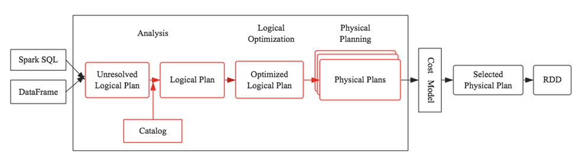

## 预备知识－Tree&Rule

在介绍SQL优化器工作原理之前，有必要首先介绍两个重要的数据结构：Tree和Rule。相信无论对SQL优化器有无了解，都肯定知道SQL语法树这个概念，不错，SQL语法树就是SQL语句通过编译器之后会被解析成一棵树状结构。这棵树会包含很多节点对象，每个节点都拥有特定的数据类型，同时会有0个或多个孩子节点（节点对象在代码中定义为TreeNode对象），下图是个简单的示例

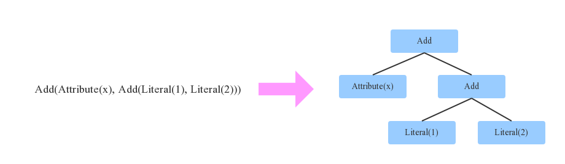

如上图所示，箭头左边表达式有3种数据类型（Literal表示常量、Attribute表示变量、Add表示动作），表示x+(1+2)。映射到右边树状结构后，每一种数据类型就会变成一个节点。另外，Tree还有一个非常重要的特性，可以通过一定的规则进行等价变换，如下图

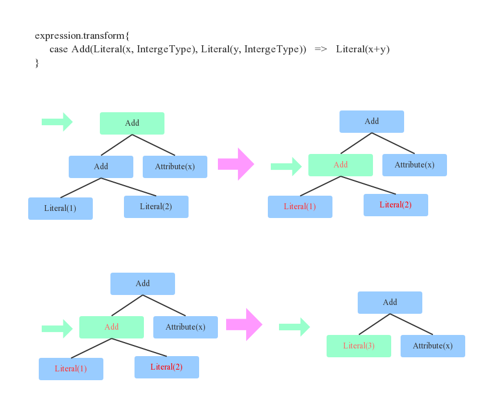

上图定义了一个等价变换规则(Rule)：两个Integer类型的常量相加可以等价转换为一个Integer常量，这个规则其实很简单，对于上文中提到的表达式x+(1+2)来说就可以转变为x+3。对于程序来讲，如何找到两个Integer常量呢？其实就是简单的二叉树遍历算法，每遍历到一个节点，就模式匹配当前节点为Add、左右子节点是Integer常量的结构，定位到之后将此三个节点替换为一个Literal类型的节点。
上面用一个最简单的示例来说明等价变换规则以及如何将规则应用于语法树。在任何一个SQL优化器中，通常会定义大量的Rule（后面会讲到），SQL优化器会遍历语法树中每个节点，针对遍历到的节点模式匹配所有给定规则（Rule），如果有匹配成功的，就进行相应转换，如果所有规则都匹配失败，就继续遍历下一个节点

## Catalyst工作流程

任何一个优化器工作原理都大同小异：SQL语句首先通过Parser模块被解析为语法树，此棵树称为Unresolved Logical Plan；Unresolved Logical Plan通过Analyzer模块借助于数据元数据解析为Logical Plan；此时再通过各种基于规则的优化策略进行深入优化，得到Optimized Logical Plan；优化后的逻辑执行计划依然是逻辑的，并不能被Spark系统理解，此时需要将此逻辑执行计划转换为Physical Plan；为了更好的对整个过程进行理解，下文通过一个简单示例进行解释

### Parser

Parser简单来说是将SQL字符串切分成一个一个Token，再根据一定语义规则解析为一棵语法树（AST）。Parser模块目前基本都使用第三方类库ANTLR进行实现，比如Hive、 Presto、SparkSQL等。下图是一个示例性的SQL语句（有两张表，其中people表主要存储用户基本信息，score表存储用户的各种成绩），通过Parser解析后的AST语法树如右图所示

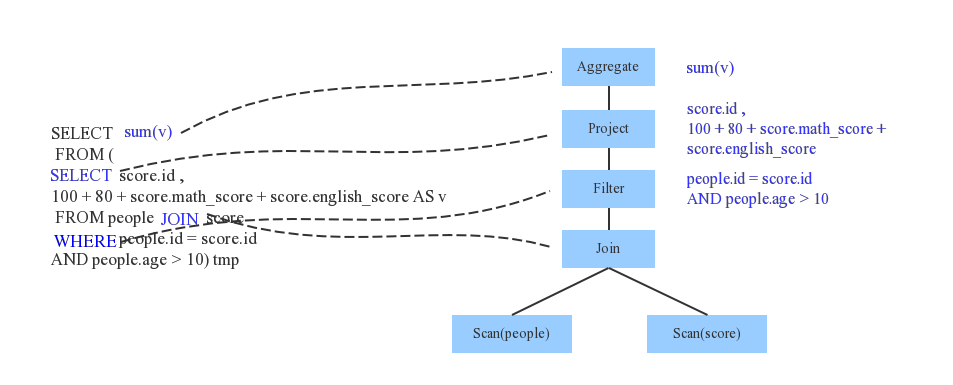

### Analyzer

通过解析后的逻辑执行计划基本有了骨架，但是系统并不知道score、sum这些都是些什么鬼，此时需要基本的元数据信息来表达这些词素，最重要的元数据信息主要包括两部分：表的Scheme和基本函数信息，表的scheme主要包括表的基本定义（列名、数据类型）、表的数据格式（Json、Text）、表的物理位置等，基本函数信息主要指类信息。
Analyzer会再次遍历整个语法树，对树上的每个节点进行数据类型绑定以及函数绑定，比如people词素会根据元数据表信息解析为包含age、id以及name三列的表，people.age会被解析为数据类型为int的变量，sum会被解析为特定的聚合函数，如下图所示

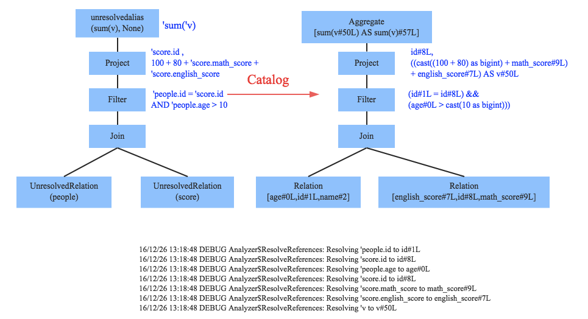

SparkSQL中Analyzer定义了各种解析规则，有兴趣深入了解的童鞋可以查看Analyzer类，其中定义了基本的解析规则，如下

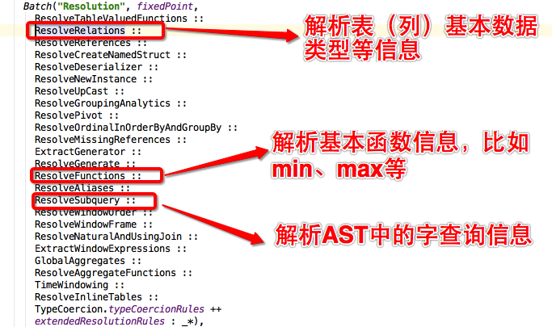

### Optimizer

优化器是整个Catalyst的核心，上文提到优化器分为基于规则优化和基于代价优化两种，当前SparkSQL 2.1依然没有很好的支持基于代价优化（下文细讲），此处只介绍基于规则的优化策略，基于规则的优化策略实际上就是对语法树进行一次遍历，模式匹配能够满足特定规则的节点，再进行相应的等价转换。因此，基于规则优化说到底就是一棵树等价地转换为另一棵树。SQL中经典的优化规则有很多，下文结合示例介绍三种比较常见的规则：谓词下推（Predicate Pushdown）、常量累加（Constant Folding）和列值裁剪（Column Pruning）

#### Predicate Pushdown

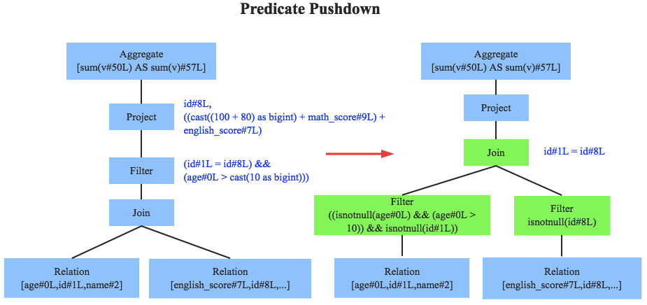

上图左边是经过Analyzer解析后的语法树，语法树中两个表先做join，之后再使用age>10对结果进行过滤。大家知道join算子通常是一个非常耗时的算子，耗时多少一般取决于参与join的两个表的大小，如果能够减少参与join两表的大小，就可以大大降低join算子所需时间。谓词下推就是这样一种功能，它会将过滤操作下推到join之前进行，上图中过滤条件age>0以及id!=null两个条件就分别下推到了join之前。这样，系统在扫描数据的时候就对数据进行了过滤，参与join的数据量将会得到显著的减少，join耗时必然也会降低

#### Constant Folding

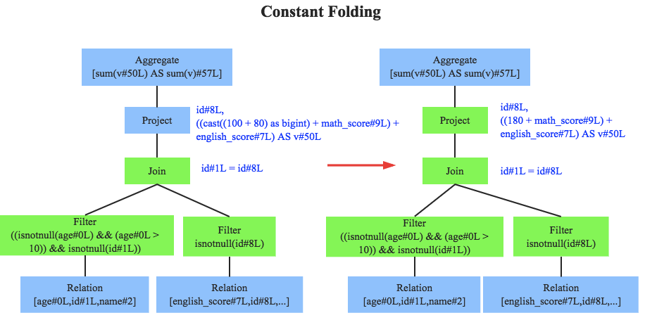

常量累加其实很简单，就是上文中提到的规则  x+(1+2)  -> x+3，虽然是一个很小的改动，但是意义巨大。示例如果没有进行优化的话，每一条结果都需要执行一次100+80的操作，然后再与变量math_score以及english_score相加，而优化后就不需要再执行100+80操作

#### Column Pruning

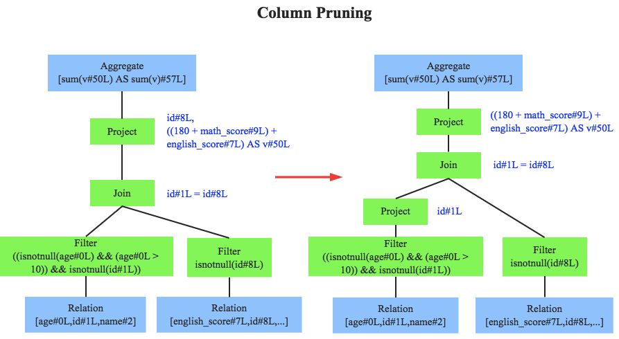

列值裁剪是另一个经典的规则，示例中对于people表来说，并不需要扫描它的所有列值，而只需要列值id，所以在扫描people之后需要将其他列进行裁剪，只留下列id。这个优化一方面大幅度减少了网络、内存数据量消耗，另一方面对于列存数据库（Parquet）来说大大提高了扫描效率。除此之外，Catalyst还定义了很多其他优化规则，有兴趣深入了解的童鞋可以查看Optimizer类，下图简单的截取一部分规则

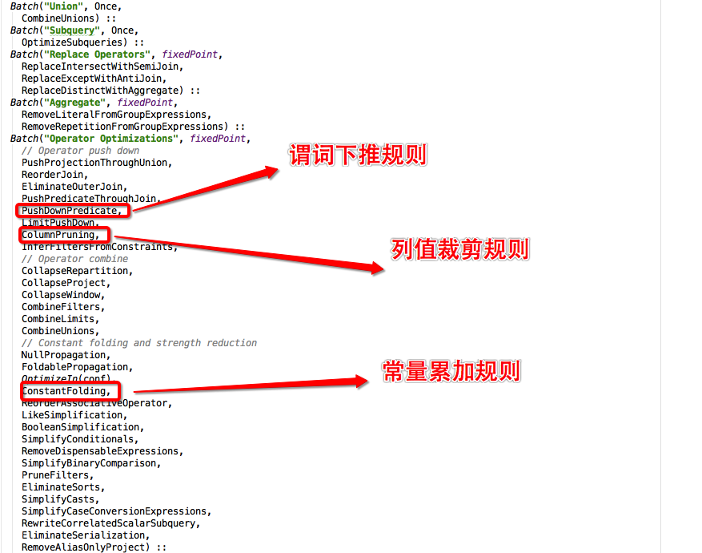

至此，逻辑执行计划已经得到了比较完善的优化，然而，逻辑执行计划依然没办法真正执行，他们只是逻辑上可行，实际上Spark并不知道如何去执行这个东西。比如Join只是一个抽象概念，代表两个表根据相同的id进行合并，然而具体怎么实现这个合并，逻辑执行计划并没有说明

### 逻辑执行计划转换为物理执行计划

此时就需要将逻辑执行计划转换为物理执行计划，将逻辑上可行的执行计划变为Spark可以真正执行的计划。比如Join算子，Spark根据不同场景为该算子制定了不同的算法策略，有BroadcastHashJoin、ShuffleHashJoin以及SortMergeJoin等（可以将Join理解为一个接口，BroadcastHashJoin是其中一个具体实现），物理执行计划实际上就是在这些具体实现中挑选一个耗时最小的算法实现，这个过程涉及到基于代价优化策略，后续文章细讲

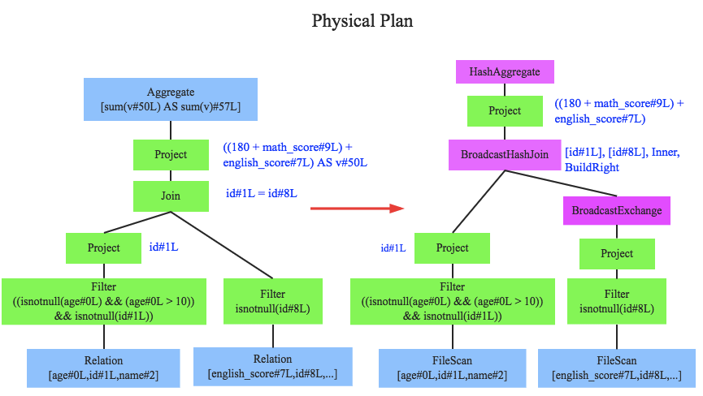

# CBO(基于代价优化)

CBO是Cost-Based Optimization的缩写。它是看语句的代价(Cost),这里的代价主要指Cpu和内存。优化器在判断是否用这种方式时,主要参照的是表及索引的统计信息。统计信息给出表的大小、多少行、每行的长度等信息。这些统计信息起初在库内是没有的，是做analyze后才出现的，很多的时候过期统计信息会令优化器做出一个错误的执行计划,因些应及时更新这些信息.

CRO是一种经验式、启发式的优化思路，优化规则都已经预先定义好，只需要将SQL往这些规则上套就可以。 说白了，CRO就像是一个经验丰富的老司机，基本套路全都知道。然而世界上有一种东西叫做 - 不按套路来，与其说它不按套路来，倒不如说它本身就没有什么套路而言。最典型的莫过于复杂Join算子，对于这些复杂的Join来说，通常有两个对优化相当重要的问题需要决定：

  1. 该Join应该选择哪种策略来执行？BroadcastJoin or ShuffleHashJoin or SortMergeJoin？不同的执行策略对系统的资源要求不同，执行效率也有天壤之别，同一个SQL，选择到合适的策略执行可能只需要几秒钟，而如果没有选择到合适的执行策略就可能会导致系统OOM

  2. 对于雪花模型或者星型模型来讲，多表Join应该选择什么样的顺序执行？不同的Join顺序意味着不同的执行效率，比如A join B join C，A、B表都很大，C表很小，那A join B很显然需要大量的系统资源来运算，执行时间肯定不会短。而如果使用A join C join B的执行顺序，因为C表很小，所以A join C会很快得到结果，而且结果集会很小，再使用小的结果集 join B，结果必然也会很小

首先来看第一个问题，当前SparkSQL会让用户指定参数'spark.sql.autoBroadcastJoinThreshold’来决定是否采用BroadcastJoin策略，简单来说，它会选择参与Join的两表中的小表大小与该值进行对比，如果小表大小小于该配置值，就将此表进行广播；否则采用SortMergeJoin策略。对于SparkSQL采取的方式，有两个问题需要深入分析
  - 参数'spark.sql.autoBroadcastJoinThreshold’指定的是表的大小（size），而不是条数。这样完全合理吗？我们知道Join算子会将两表中具有相同key的记录合并在一起，因此Join的复杂度只与两表的数据条数有关，而与表大小（size）没有直接的关系。这样一想，其实参数'spark.sql.autoBroadcastJoinThreshold’应该更多地是考虑广播的代价，而不是Join本身的代价

  - 之前Catalyst文章中我们讲到谓词下推规则，Catalyst会将很多过滤条件下推到Join之前，因此参与Join的两表大小并不应该是两张原始表的大小，而是经过过滤后的表数据大小。因此，单纯的知道原始表大小还远远不够，Join优化还需要评估过滤后表数据大小以及表数据条数

对于第二个问题，也面临和第一个问题同样的两点缺陷，举个简单的例子

```sql
select * from A , B , C where A.id = B.b_id and A.id = C.c_id and C.c_id > 100
```

> 假设：A、B、C总纪录大小分别是100m，40m，60m，C.c_id > 100过滤后C的总纪录数会降到10m

上述SQL是一个典型的A join B join C的多Join示例，很显然，A肯定在最前面，现在问题是B和C的Join顺序，是A join B join C还是A join C join B。对于上面的示例，优化器会有两种最基本的选择，第一就是按照用户手写的Join顺序执行，即按照‘A.id = B.b_id and A.id = C.c_id ’顺序， 得到的执行顺序是A join B join C。第二是按照A、B 、C三表的原始大小进行组织排序，原始表小的先Join，原始表大的后Join，适用这种规则得到的顺序依然是A join B join C，因为B的记录大小小于C的记录大小

同样的道理，第一个缺陷很明显，记录大小并不能精确作为Join代价的计算依据，而应该是记录条数。第二就是对于过滤条件的忽略，上述示例中C经过过滤后的大小降到10m，明显小于B的40m，因此实际上应该执行的顺序为A join C join B，与上述得到的结果刚好相反

可见，基于规则的优化策略并不适合复杂Join的优化，此时就需要另一种优化策略 - 基于代价优化（CBO）。基于代价优化策略实际只做两件事，就是解决上文中提到的两个问题

  1. 解决参与Join的数据表大小并不能完全作为计算Join代价依据的问题，而应该加入数据记录条数这个维度

  2. 解决Join代价计算应该考虑谓词下推（等）条件的影响，不能仅仅关注原始表的大小。这个问题看似简单，实际上很复杂，需要优化器将逻辑执行计划树上的每一个节点的<数据量，数据条数>都评估出来，这样的话，评估Join的执行策略、执行顺序就不再以原始表大小作为依据，而是真实参与Join的两个数据集的大小条数作为依据

## CBO实现思路

经过上文的解释，可以明确CBO的本质就是计算LogionPlan每个节点的输出数据大小与数据条数，作为复杂Join算子的代价计算依据。逻辑执行计划树的叶子节点是原始数据，往上会经过各种过滤条件以及其他函数的限制，父节点依赖于子节点。整个过程可以变换为子节点经过特定计算评估父节点的输出，计算出来之后父节点将会作为上一层的子节点往上计算。因此，CBO可以分解为两步

  1. 一次性计算出原始数据的相关数据
  2. 再对每类节点制定一种对应的评估规则就可以自下往上评估出所有节点的代价值

### 一次性计算出原始表的相关数据

这个操作是CBO最基础的一项工作，在计算之前，我们需要明确“相关数据”是什么？这里给出核心的统计信息如下
  - estimatedSize: 每个LogicalPlan节点输出数据大小（解压）
  - rowCount: 每个LogicalPlan节点输出数据总条数
  - basicStats: 基本列信息，包括列类型、Max、Min、number of nulls, number of distinct values, max column length, average column length等
  - Histograms: Histograms of columns, i.e., equi-width histogram (for numeric and string types) and equi-height histogram (only for numeric types).

至于为什么要统计这么多数据，下文会讲到。现在再来看如何进行统计，有两种比较可行的方案
  1. 打开所有表扫描一遍，这样最简单，而且统计信息准确，缺点是对于大表来说代价比较大。hive和impala目前都采用的这种方式
    - hive统计原始表命令：analyse table
    - impala统计原始表明了：compute stats
  2. 针对一些大表，扫描一遍代价太大，可以采用采样（sample）的方式统计计算

### 代价评估规则&计算所有节点统计信息

代价评估规则意思是说在当前子节点统计信息的基础上，计算父节点相关统计信息的一套规则。 对于不同谓词节点，评估规则必然不一样，比如fliter、group by、limit等等的评估规则不同。 假如现在已经知道表C的基本统计信息，对于

```sql
select * from A , B , C where A.id = B.b_id and A.id = C.c_id and C.c_id > N
```

这个条件，如何评估经过C.c_id > N过滤后的基本统计信息。我们来看看

  1. 假设当前已知C列的最小值c_id.Min、最大值c_id.Max以及总行数c_id.Distinct，如下图所示

  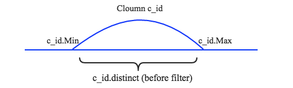

  2. 现在分别有三种情况需要说明，其一是N小于c_id.Min，其二是N大于c_id.Max，其三是N介于c_id.Min和c_id.Max之间。前两种场景是第三种场景的特殊情况，这里简单的针对第三种场景说明。如下图所示

  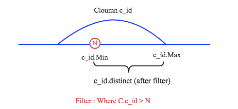

在C.c_id > N过滤条件下，c_id.Min会增大到N，c_id.Max保持不变。而过滤后总行数

```
c_id.distinct(after filter) ＝ (c_id.Max - N) / (c_id.Max - c_id.Min) * c_id.distinct(before filter)
```

当然，上述计算只是示意性计算，真实算法会复杂很多。另外，如果大家对group by 、limit等谓词的评估规则比较感兴趣的话，可以阅读 [SparkSQL CBO设计文档](./Spark_CBO_Design_Spec.pdf)  ，在此不再赘述。至此，通过各种评估规则就可以计算出语法树中所有节点的基本统计信息，当然最重要的是参与Join的数据集节点的统计信息。最后只需要根据这些统计信息选择最优的Join算法以及Join顺序，最终得到最优的物理执行计划


# Hive - CBO优化效果

Hive本身没有去从头实现一个SQL优化器，而是借助于 [Apache Calcite](http://calcite.apache.org/)，Calcite是一个开源的、基于CBO的企业级SQL查询优化框架，目前包括Hive、Phoniex、Kylin以及Flink等项目都使用了Calcite作为其执行优化器，这也很好理解，执行优化器本来就可以抽象成一个系统模块，并没有必要花费大量时间去重复造轮子。
hortonworks曾经对Hive的CBO特性做了相关的测试，测试结果认为CBO至少对查询有三个重要的影响：Join ordering optimization、Bushy join support以及Join simplification，本文只简单介绍一下Join ordering optimization。
hortonworks对TPCDS的部分Query进行了研究，发现对于大部分星型雪花模型，都存在多Join问题，这些Join顺序如果组织不好，性能就会很差，如果组织得当，性能就会很好

```sql
select
    dt.d_year,
    item.i_brand_id brand_id,
    item.i_brand brand,
    sum(ss_ext_sales_price) sum_agg
from
    date_dim dt,
    store_sales,
    item
where
    dt.d_date_sk = store_sales.ss_sold_date_sk
    and store_sales.ss_item_sk = item.i_item_sk
    and item.i_manufact_id =436
    and dt.d_moy =12
groupby dt.d_year , item.i_brand , item.i_brand_id
order by dt.d_year , sum_agg desc , brand_id
limit 10
```

上述Query涉及到3张表，一张事实表store_sales（数据量大）和两张维度表（数据量小），三表之间的关系如下图所示

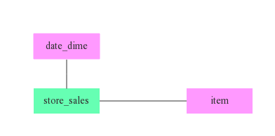

这里就涉及上文提到的Join顺序问题，从原始表来看，date_dime有73049条记录，而item有462000条记录。很显然，如果没有其他暗示的话，Join顺序必然是store_sales join date_time join item。但是，where条件中还带有两个条件，CBO会根据过滤条件对过滤后的数据进行评估，结果如下

Table|Cardinality|Cardinality after filter|Selectivity
--|:--:|--:|--:
date_dim|73,049|6200|8.5%
item|462,000|484|0.1%

根据上表所示，过滤后的数据量item明显比date_dim小的多，剧情反转的有点快。于是乎，经过CBO之后Join顺序就变成了store_sales join item join date_time，为了进一步确认，可以在开启CBO前后分别记录该SQL的执行计划，如下图所示

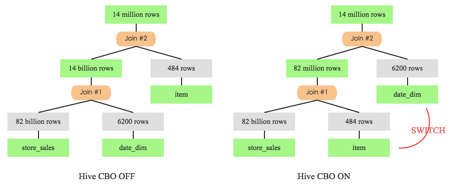

左图是未开启CBO特性时Q3的执行计划，store_sales先与date_dim进行join，join后的中间结果数据集有140亿条。而再看右图，store_sales先于item进行join，中间结果只有8200w条。很显然，后者执行效率会更高，实践出真知，来看看两者的实际执行时间

Test|Query Response Time(seconds)|Intermediate Rows|CPU(seconds)
--|:--:|--:|--:
Q3 CBO OFF|255|13,987,506,884|51,967
Q3 CBO ON|142|86,217,653|35,036

上图很明显的看出Q3在CBO的优化下性能将近提升了1倍，与此同时，CPU资源使用率也降低了一半左右

# Vectorized Query Execution

Vectorized query execution is a Hive feature that greatly reduces the CPU usage for typical query operations like scans, filters, aggregates, and joins. A standard query execution system processes one row at a time. This involves long code paths and significant metadata interpretation in the inner loop of execution. Vectorized query execution streamlines operations by processing a block of 1024 rows at a time.Within the block, each column is stored as a vector (an array of a primitive data type). Simple operations like arithmetic and comparisons are done by quickly iterating through the vectors in a tight loop, with no or very few function calls or conditional branches inside the loop. These loops compile in a streamlined way that uses relatively few instructions and finishes each instruction in fewer clock cycles, on average, by effectively using the processor pipeline and cache memory. A detailed design document is attached to the vectorized query execution JIRA, at [https://issues.apache.org/jira/browse/HIVE-4160](https://issues.apache.org/jira/browse/HIVE-4160)

## Enabling vectorized execution

To use vectorized query execution, you must store your data in **ORC** format, and set the following variable as shown in Hive SQL

```
set hive.vectorized.execution.enabled = true;
```

Additional configuration variables for vectorized execution are documented in [Configuration Properties – Vectorization.](https://cwiki.apache.org/confluence/display/Hive/Configuration+Properties#ConfigurationProperties-Vectorization)

## Supported data types and operations

The following data types are currently supported for vectorized execution:

  - tinyint
  - smallint
  - int
  - bigint
  - boolean
  - float
  - double
  - decimal
  - date
  - timestamp (see Limitations below)
  - string

Using other data types will cause your query to execute using standard, row-at-a-time execution

The following expressions can be vectorized when used on supported types:

  - arithmetic: +, -, *, /, %
  - AND, OR, NOT
  - comparisons <, >, <=, >=, =, !=, BETWEEN, IN ( list-of-constants ) as filters
  - Boolean-valued expressions (non-filters) using AND, OR, NOT, <, >, <=, >=, =, !=
  - IS [NOT] NULL
  - all math functions (SIN, LOG, etc.)
  - string functions SUBSTR, CONCAT, TRIM, LTRIM, RTRIM, LOWER, UPPER, LENGTH
  - type casts
  - Hive user-defined functions, including standard and generic UDFs
  - date functions (YEAR, MONTH, DAY, HOUR, MINUTE, SECOND, UNIX_TIMESTAMP)
  - the IF conditional expression

## Seeing whether vectorization is used for a query

You can verify which parts of your query are being vectorized using the explain feature. For example, when Fetch is used in the plan instead of Map, it does not vectorize and the explain output will not include the **"Execution mode: vectorized"** notation

```SQL
create table src(key int, value string) stored as orc;
set hive.vectorized.execution.enabled = true;
explain select count(*) from src;
+------------------------------------------------------------------------------------------------------------+--+
|                                                  Explain                                                   |
+------------------------------------------------------------------------------------------------------------+--+
| STAGE DEPENDENCIES:                                                                                        |
|   Stage-1 is a root stage                                                                                  |
|   Stage-0 depends on stages: Stage-1                                                                       |
|                                                                                                            |
| STAGE PLANS:                                                                                               |
|   Stage: Stage-1                                                                                           |
|     Map Reduce                                                                                             |
|       Map Operator Tree:                                                                                   |
|           TableScan                                                                                        |
|             alias: src                                                                                     |
|             Statistics: Num rows: 10958 Data size: 1041010 Basic stats: COMPLETE Column stats: COMPLETE    |
|             Select Operator                                                                                |
|               Statistics: Num rows: 10958 Data size: 1041010 Basic stats: COMPLETE Column stats: COMPLETE  |
|               Group By Operator                                                                            |
|                 aggregations: count()                                                                      |
|                 mode: hash                                                                                 |
|                 outputColumnNames: _col0                                                                   |
|                 Statistics: Num rows: 1 Data size: 8 Basic stats: COMPLETE Column stats: COMPLETE          |
|                 Reduce Output Operator                                                                     |
|                   sort order:                                                                              |
|                   Statistics: Num rows: 1 Data size: 8 Basic stats: COMPLETE Column stats: COMPLETE        |
|                   value expressions: _col0 (type: bigint)                                                  |
|       Execution mode: vectorized                                                                           |
|       Reduce Operator Tree:                                                                                |
|         Group By Operator                                                                                  |
|           aggregations: count(VALUE._col0)                                                                 |
|           mode: mergepartial                                                                               |
|           outputColumnNames: _col0                                                                         |
|           Statistics: Num rows: 1 Data size: 8 Basic stats: COMPLETE Column stats: COMPLETE                |
|           File Output Operator                                                                             |
|             compressed: true                                                                               |
|             Statistics: Num rows: 1 Data size: 8 Basic stats: COMPLETE Column stats: COMPLETE              |
|             table:                                                                                         |
|                 input format: org.apache.hadoop.mapred.SequenceFileInputFormat                             |
|                 output format: org.apache.hadoop.hive.ql.io.HiveSequenceFileOutputFormat                   |
|                 serde: org.apache.hadoop.hive.serde2.lazy.LazySimpleSerDe                                  |
|                                                                                                            |
|   Stage: Stage-0                                                                                           |
|     Fetch Operator                                                                                         |
|       limit: -1                                                                                            |
|       Processor Tree:                                                                                      |
|         ListSink                                                                                           |
|                                                                                                            |
+------------------------------------------------------------------------------------------------------------+--+
```

# Correlation Optimizer

In Hadoop environments, an SQL query submitted to Hive will be evaluated in distributed systems. Thus, after generating a query operator tree representing the submitted SQL query, Hive needs to determine what operations can be executed in a task which will be evalauted in a single node. Also, since a MapReduce job can shuffle data once, Hive also needs to cut the tree to multiple MapReduce jobs. It is important to cut an operator tree to multiple MapReduce in a good way, so the generated plan can evaluate the query efficiently.

When generating an operator tree for a given SQL query, Hive identifies when to shuffle the data through operations which may need to shuffle data. For example, a JOIN operation may need to shuffle the input data if input tables have not been distributed by join columns. However, in a complex query, it is possible that the input data of an operation which may need to shuffle the input data has already been partitioned in the desired way. For example, it is possible we can have a query like

```sql
SELECT t1.key, sum(value) FROM t1 JOIN t2 ON (t1.key = t2.key) GROUP BY t1.key
```

In this example, both JOIN operation and GROUP BY operation may need to shuffle the input data. However, because the output of JOIN operation is the input of GROUP BY operation and it has been already partitioned by t1.key, we do not need to shuffle the data for GROUP BY operation. However, Hive is not aware this correlation between JOIN operation and GROUP BY operation and thus it will generate two separate MapReduce jobs to evaluate this query. Basically, we unnecessarily shuffle the data for GROUP BY operation. In a more complex query, correlation-unaware query planning can generate a very inefficient execution plan and result in poor performance.

Before we integrating Correlation Optimizer into Hive, Hive has ReduceSink Deduplication Optimizer which can figure out if we need to shuffle data for chained operators. However, to support more complex operator trees, we need a more general-purpose optimizer and a mechanism to correctly execute optimized plan. Thus, we have designed and implemented Correlation Optimizer and two operators for evaluating optimized plans. It is worth noting that it is better to use ReduceSink Deduplication Optimizer to handle simple cases first and then use Correlation Optimizer to handle more complex cases.

```
set hive.optimize.correlation=true;
```

## Examples

At first, let's take a look at three examples. For every query, we show the original operator tree generated by Hive and the optimized operator tree. To be concise, we only show the following operators, which are `FileSinkOperator (FS)`, `GroupByOperator (AGG)`, `HashTableSinkOperator (HT)`, `JoinOperator (JOIN)`, `MapJoinOperator (MJ)`, and `ReduceSinkOperator (RS)`. Also, in every query, we add comments (e.g. `/*JOIN1*/`) to indicate the node in the operator tree that an operation belongs to.

### Example 1

```sql
SELECT tmp1.key, count(*)
FROM (SELECT key, avg(value) AS avg
      FROM t1
      GROUP BY /*AGG1*/ key) tmp1
JOIN /*JOIN1*/ t1 ON (tmp1.key = t2.key)
WHERE t1.value > tmp1.avg
GROUP BY /*AGG2*/ tmp1.key;
```

The original operator tree generated by Hive is shown below.

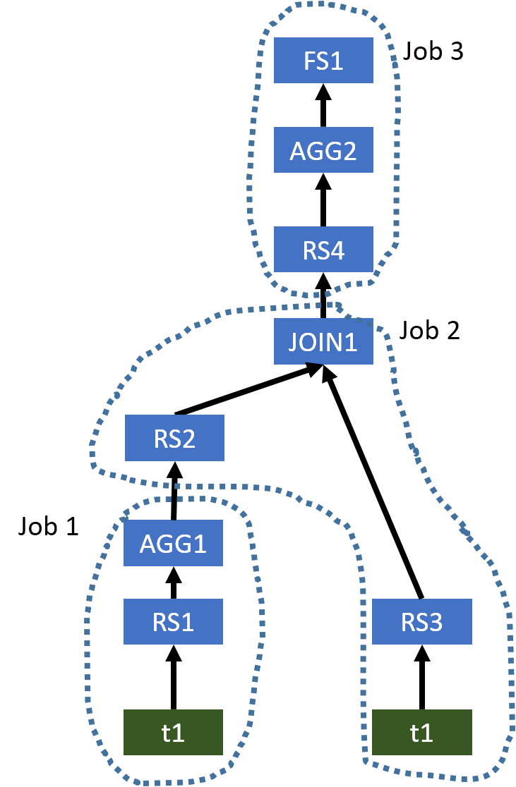

This plan uses three MapReduce jobs to evaluate this query. However, AGG1, JOIN1, and AGG2 all require the column key to be the partitioning column for shuffling the data. Thus, we do not need to shuffle the data in the same way three times. We only need to shuffle the data once, and thus a single MapReduce job is needed. The optimized operator tree is shown below

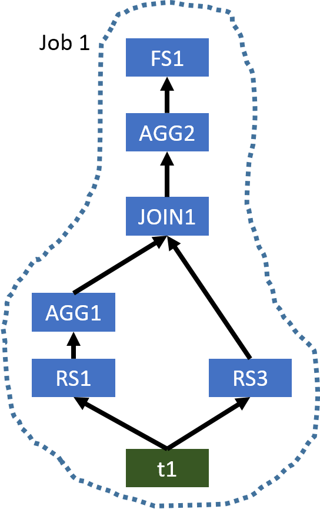

Since the input table of AGG1 and the left table of JOIN1 are both t1, when we use a single MapReduce job to evaluate this query, Hive only needs to scan t1 once. While, in the original plan, t1 is used in two MapReduce jobs, and thus it is scanned twice.

### Example 2

```sql
SELECT tmp1.key, count(*)
FROM t1
JOIN /*JOIN1*/ (SELECT key, avg(value) AS avg
                FROM t1
                GROUP BY /*AGG1*/ key) tmp1 ON (t1.key = tmp1.key)
JOIN /*JOIN1*/ t2 ON (tmp1.key = t2.key)
WHERE t2.value > tmp1.avg
GROUP BY /*AGG2*/ t1.key;
```

The original operator tree generated by Hive is shown below.

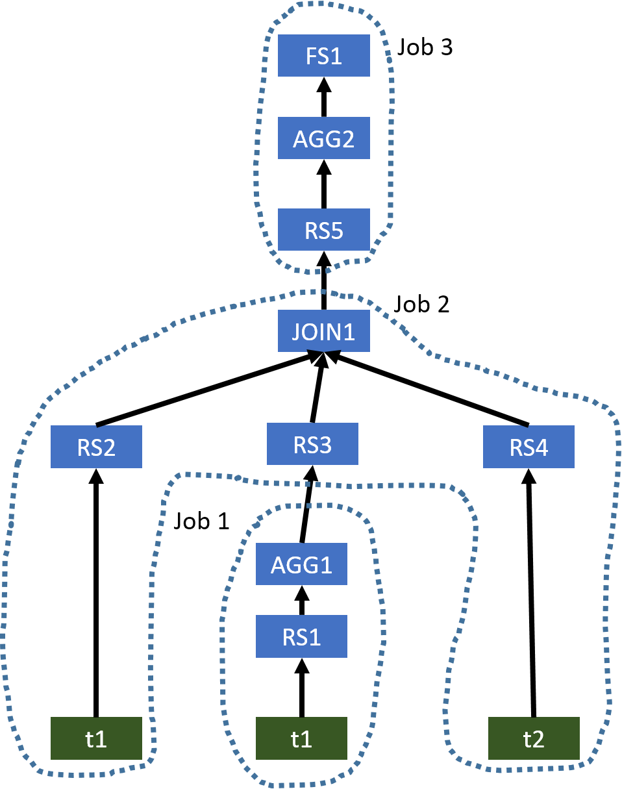

This example is similar to Example 1. The optimized operator tree only needs a single MapReduce job, which is shown below.

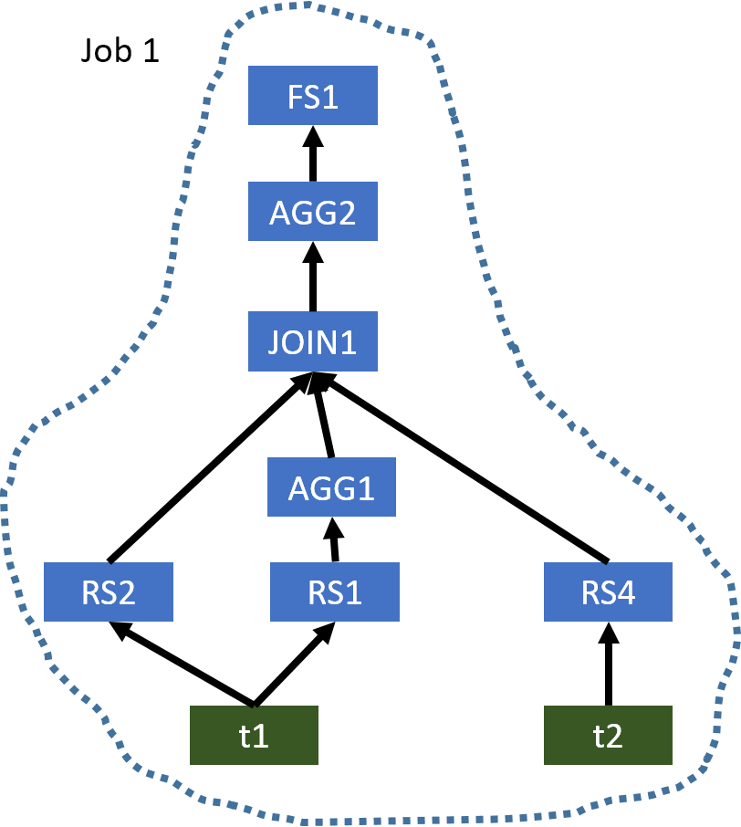

### Example 3

```SQL
SELECT count(distinct ws1.ws_order_number) as order_count,
       sum(ws1.ws_ext_ship_cost) as total_shipping_cost,
       sum(ws1.ws_net_profit) as total_net_profit
FROM web_sales ws1
JOIN /*MJ1*/ customer_address ca ON (ws1.ws_ship_addr_sk = ca.ca_address_sk)
JOIN /*MJ2*/ web_site s ON (ws1.ws_web_site_sk = s.web_site_sk)
JOIN /*MJ3*/ date_dim d ON (ws1.ws_ship_date_sk = d.d_date_sk)
LEFT SEMI JOIN /*JOIN4*/ (SELECT ws2.ws_order_number as ws_order_number
                          FROM web_sales ws2 JOIN /*JOIN1*/ web_sales ws3
                          ON (ws2.ws_order_number = ws3.ws_order_number)
                          WHERE ws2.ws_warehouse_sk <> ws3.ws_warehouse_sk) ws_wh1
ON (ws1.ws_order_number = ws_wh1.ws_order_number)
LEFT SEMI JOIN /*JOIN4*/ (SELECT wr_order_number
                          FROM web_returns wr
                          JOIN /*JOIN3*/ (SELECT ws4.ws_order_number as ws_order_number
                                          FROM web_sales ws4 JOIN /*JOIN2*/ web_sales ws5
                                          ON (ws4.ws_order_number = ws5.ws_order_number)
                                          WHERE ws4.ws_warehouse_sk <> ws5.ws_warehouse_sk) ws_wh2
                          ON (wr.wr_order_number = ws_wh2.ws_order_number)) tmp1
ON (ws1.ws_order_number = tmp1.wr_order_number)
WHERE d.d_date >= '2001-05-01' and
      d.d_date <= '2001-06-30' and
      ca.ca_state = 'NC' and
      s.web_company_name = 'pri';
```

The original operator tree generated by Hive is shown below

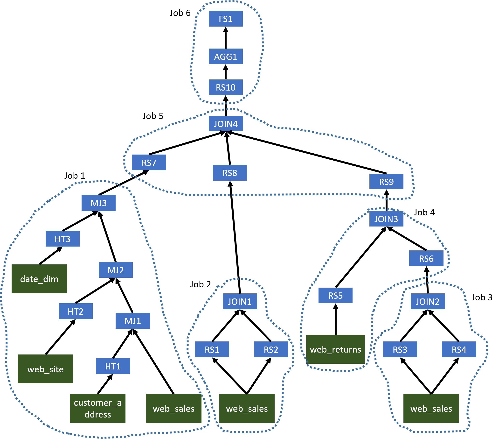

In this complex query, we will first have several MapJoins (MJ1, MJ2, and MJ3) which can be evaluated in the same Map phase. Since JOIN1, JOIN2, JOIN3, and JOIN4 use the same column as the join key, we can use a single MapReduce job to evaluate all operators before AGG1. The second MapReduce job will generate the final results. The optimized operator tree is shown below

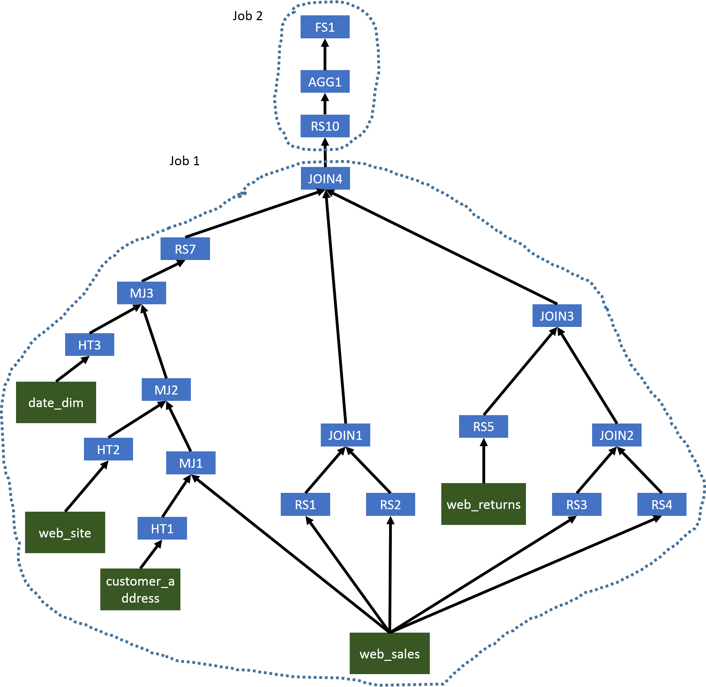


## Intra-query Correlations

In Hive, a submitted SQL query needs to be evaluated in a distributed system. When evaluating a query, data may need to shuffled sometimes. Based on the nature of different data operations, operators in Hive can be divided to two categories:
  1. Operators which do not require data shuffling. Examples are `TableScanOperator`, `SelectOperator` and `FilterOperator`.
  2. Operators which require data shuffling. Examples are `GroupByOperator` and `JoinOperator`.

For an operator requiring data shuffling, Hive will add one or multiple `ReduceSinkOperators` as parents of this operator (the number of `ReduceSinkOperators` depends on the number of inputs of the operator requiring data shuffling). Those `ReduceSinkOperators` form the boundary between the Map phase and Reduce phase. Then, Hive will cut the operator tree to multiple pieces (MapReduce tasks) and each piece can be executed in a MapReduce job.

For a complex query, it is possible that a input table is used by multiple MapReduce tasks. In this case, this table will be loaded multiple times when the original operator tree is used. Also, when generating those ReduceSinkOperators, Hive does not consider if the corresponding operator requiring data shuffling really needs a re-partitioned input data. For example, in the original operator tree of Example 1 (Figure 1), AGG1, JOIN1, and AGG2 require the data been shuffled in the same way because all of them require the column key to be the partitioning column in their corresponding ReduceSinkOperators. But, Hive is not aware this correlation between AGG1, JOIN1, and AGG2, and still generates three MapReduce tasks.

Correlation Optimizer aims to exploit two intra-qeury correlations mentioned above.

  1. Input Correlation: A input table is used by multiple MapReduce tasks in the original operator tree.
  2. Job Flow Correlation: Two dependent MapReduce tasks shuffle the data in the same way.

## Correlation Detection

In Hive, every query has one or multiple terminal operators which are the last operators in the operator tree. Those terminal operators are called FileSinkOperatos. To give an easy explanation, if an operator A is on another operator B's path to a FileSinkOperato, A is the downstream of B and B is the upstream of A.

For a given operator tree like the one shown in Figure 1, the Correlation Optimizer starts to visit operators in the tree from those FileSinkOperatos in a depth-first way. The tree walker stops at every ReduceSinkOperator. Then, a correlation detector starts to find a correlation from this ReduceSinkOperator and its siblings by finding the furthest correlated upstream ReduceSinkOperators in a recursive way. If we can find any correlated upstream ReduceSinkOperator, we find a correlation. Currently, there are three conditions to determine if a upstream ReduceSinkOperator and an downstream ReduceSinkOperator are correlated, which are:

  1. emitted rows from these two ReduceSinkOperators are sorted in the same way
  2. emitted rows from these two ReduceSinkOperators are partitioned in the same way
  3. these ReduceSinkOperators do not have any conflict on the number reducers

During the correlation detection, a JoinOperator or a UnionOperator can introduce branches to the searching path. For a JoinOperator, its parents are all ReduceSinkOperators. When the detector reaches a JoinOperator, it will check if all parents of this JoinOperator are correlated to the downstream ReduceSinkOperator. Because a JoinOperator contains one or multiple 2-way Join operations, for a ReduceSinkOperator, we can determine if another ReduceSinkOperator appearing in the same Join operation is correlated based on the Join type and positions of these ReduceSinkOperators in the Join operation with the following two rules.

  1. If a ReduceSinkOperator represents the left table of a INNER JOIN, a LEFT OUTER JOIN, or a LEFT SEMI JOIN, the ReduceSinkOperator representing the right table is also considered correlated
  2. If a ReduceSinkOperator represents the right table of a INNER JOIN, or a RIGHT OUTER JOIN, the ReduceSinkOperator representing the left table is also considered correlated

With these two rules, we start to analyze those parent ReduceSinkOperators of the JoinOperator from every ReduceSinkOperator which has columns appearing in the join clause and then we can find all correlated ReduceSinkOperators recursively. If we can find that all parent ReduceSinkOperators are correlated from every ReduceSinkOperator which has columns appearing in the join clause, we will continue the correlation detection on this branch. Otherwise, we will determine that none of ReduceSinkOperator for the JoinOperator is correlated and stop the correlation detection on this branch.

For a UnionOperator, none of its parents will be a ReduceSinkOperator. So, we check if we can find correlated ReduceSinkOperators for every parent branch of this UnionOperator. If any branch does not have a ReduceSinkOperator, we will determine that we do not find any correlated ReduceSinkOperator at parent branches of this UnionOperator.

During the process of correlation detection, it is possible that the detector can visit a JoinOperator which will be converted to a Map Join later. In this case, the detector stops searching the branch containing this Map Join. For example, in Figure 5, the detector knows that MJ1, MJ2, and MJ3 will be converted to Map Joins

## Operator Tree Transformation

In a correlation, there are two kinds of ReduceSinkOperators. The first kinds of ReduceSinkOperators are at the bottom layer of a query operator tree which are needed to emit rows to the shuffling phase. For example, in Figure 1, RS1 and RS3 are bottom layer ReduceSinkOperators. The second kinds of ReduceSinkOperators are unnecessary ones which can be removed from the optimized operator tree. For example, in Figure 1, RS2 and RS4 are unnecessary ReduceSinkOperators. Because the input rows of the Reduce phase may need to be forwarded to different operators and those input rows are coming from a single stream, we add a new operator called DemuxOperator to dispatch input rows of the Reduce phase to corresponding operators. In the operator tree transformation, we first connect children of those bottom layer ReduceSinkOperators to the DemuxOperator and reassign tags of those bottom layer ReduceSinkOperators (the DemuxOperator is the only child of those bottom layer ReduceSinkOperators). In the DemuxOperator, we record two mappings. The first one is called newTagToOldTag which maps those new tags assigned to those bottom layer ReduceSinkOperators to their original tags. Those original tags are needed to make JoinOperator work correctly. The second mapping is called newTagToChildIndex which maps those new tags to the children indexes. With this mapping, the DemuxOperator can know the correct operator that a row needs to be forwarded based on the tag of this row. The second step of operator tree transformation is to remove those unnecessary ReduceSinkOperators. To make the operator tree in the Reduce phase work correctly, we add a new operator called `MuxOperator` to the original place of those unnecessary ReduceSinkOperators. It is worth noting that if an operator has multiple unnecessary ReduceSinkOperators as its parents, we only add a single MuxOperator.

```SQL
create table test.src(key int, value int) stored as orc;
set hive.optimize.correlation=false;

EXPLAIN SELECT tmp1.key, count(*)
FROM (SELECT key, avg(value) AS avg
      FROM src
      GROUP BY /*AGG1*/ key) tmp1
JOIN /*JOIN1*/ src ON (tmp1.key = src.key)
WHERE src.value > tmp1.avg
GROUP BY /*AGG2*/ tmp1.key;

STAGE DEPENDENCIES:
  Stage-1 is a root stage
  Stage-6 depends on stages: Stage-1
  Stage-3 depends on stages: Stage-6
  Stage-0 depends on stages: Stage-3

STAGE PLANS:
  Stage: Stage-1
    Map Reduce
      Map Operator Tree:
          TableScan
            alias: src
            Statistics: Num rows: 10958 Data size: 87664 Basic stats: COMPLETE Column stats: NONE
            Filter Operator
              predicate: key is not null (type: boolean)
              Statistics: Num rows: 10958 Data size: 87664 Basic stats: COMPLETE Column stats: NONE
              Group By Operator
                aggregations: sum(value), count(value)
                keys: key (type: int)
                mode: hash
                outputColumnNames: _col0, _col1, _col2
                Statistics: Num rows: 10958 Data size: 87664 Basic stats: COMPLETE Column stats: NONE
                Reduce Output Operator
                  key expressions: _col0 (type: int)
                  sort order: +
                  Map-reduce partition columns: _col0 (type: int)
                  Statistics: Num rows: 10958 Data size: 87664 Basic stats: COMPLETE Column stats: NONE
                  value expressions: _col1 (type: bigint), _col2 (type: bigint)
      Execution mode: vectorized
      Reduce Operator Tree:
        Group By Operator
          aggregations: sum(VALUE._col0), count(VALUE._col1)
          keys: KEY._col0 (type: int)
          mode: mergepartial
          outputColumnNames: _col0, _col1, _col2
          Statistics: Num rows: 5479 Data size: 43832 Basic stats: COMPLETE Column stats: NONE
          Select Operator
            expressions: _col0 (type: int), (_col1 / _col2) (type: double)
            outputColumnNames: _col0, _col1
            Statistics: Num rows: 5479 Data size: 43832 Basic stats: COMPLETE Column stats: NONE
            File Output Operator
              compressed: false
              table:
                  input format: org.apache.hadoop.mapred.SequenceFileInputFormat
                  output format: org.apache.hadoop.hive.ql.io.HiveSequenceFileOutputFormat
                  serde: org.apache.hadoop.hive.serde2.lazybinary.LazyBinarySerDe

  Stage: Stage-6
    Map Reduce Local Work
      Alias -> Map Local Tables:
        $hdt$_1:src 	
          Fetch Operator
            limit: -1
      Alias -> Map Local Operator Tree:
        $hdt$_1:src 	
          TableScan
            alias: src
            Statistics: Num rows: 10958 Data size: 87664 Basic stats: COMPLETE Column stats: NONE
            Filter Operator
              predicate: key is not null (type: boolean)
              Statistics: Num rows: 10958 Data size: 87664 Basic stats: COMPLETE Column stats: NONE
              Select Operator
                expressions: key (type: int), value (type: int)
                outputColumnNames: _col0, _col1
                Statistics: Num rows: 10958 Data size: 87664 Basic stats: COMPLETE Column stats: NONE
                HashTable Sink Operator
                  keys:
                    0 _col0 (type: int)
                    1 _col0 (type: int)

  Stage: Stage-3
    Map Reduce
      Map Operator Tree:
          TableScan
            Map Join Operator
              condition map:
                   Inner Join 0 to 1
              keys:
                0 _col0 (type: int)
                1 _col0 (type: int)
              outputColumnNames: _col0, _col1, _col3
              Statistics: Num rows: 12053 Data size: 96430 Basic stats: COMPLETE Column stats: NONE
              Filter Operator
                predicate: (UDFToDouble(_col3) > _col1) (type: boolean)
                Statistics: Num rows: 4017 Data size: 32137 Basic stats: COMPLETE Column stats: NONE
                Select Operator
                  expressions: _col0 (type: int)
                  outputColumnNames: _col0
                  Statistics: Num rows: 4017 Data size: 32137 Basic stats: COMPLETE Column stats: NONE
                  Group By Operator
                    aggregations: count()
                    keys: _col0 (type: int)
                    mode: hash
                    outputColumnNames: _col0, _col1
                    Statistics: Num rows: 4017 Data size: 32137 Basic stats: COMPLETE Column stats: NONE
                    Reduce Output Operator
                      key expressions: _col0 (type: int)
                      sort order: +
                      Map-reduce partition columns: _col0 (type: int)
                      Statistics: Num rows: 4017 Data size: 32137 Basic stats: COMPLETE Column stats: NONE
                      value expressions: _col1 (type: bigint)
      Execution mode: vectorized
      Local Work:
        Map Reduce Local Work
      Reduce Operator Tree:
        Group By Operator
          aggregations: count(VALUE._col0)
          keys: KEY._col0 (type: int)
          mode: mergepartial
          outputColumnNames: _col0, _col1
          Statistics: Num rows: 2008 Data size: 16064 Basic stats: COMPLETE Column stats: NONE
          File Output Operator
            compressed: false
            Statistics: Num rows: 2008 Data size: 16064 Basic stats: COMPLETE Column stats: NONE
            table:
                input format: org.apache.hadoop.mapred.SequenceFileInputFormat
                output format: org.apache.hadoop.hive.ql.io.HiveSequenceFileOutputFormat
                serde: org.apache.hadoop.hive.serde2.lazy.LazySimpleSerDe

  Stage: Stage-0
    Fetch Operator
      limit: -1
      Processor Tree:
        ListSink

-- use correlation optimization
set hive.optimize.correlation=true;

SELECT tmp1.key, count(*)
FROM (SELECT key, avg(value) AS avg
      FROM src
      GROUP BY /*AGG1*/ key) tmp1
JOIN /*JOIN1*/ src ON (tmp1.key = src.key)
WHERE src.value > tmp1.avg
GROUP BY /*AGG2*/ tmp1.key;

Explain
STAGE DEPENDENCIES:
  Stage-1 is a root stage
  Stage-0 depends on stages: Stage-1

STAGE PLANS:
  Stage: Stage-1
    Map Reduce
      Map Operator Tree:
          TableScan
            alias: src
            Statistics: Num rows: 10958 Data size: 87664 Basic stats: COMPLETE Column stats: NONE
            Filter Operator
              predicate: key is not null (type: boolean)
              Statistics: Num rows: 10958 Data size: 87664 Basic stats: COMPLETE Column stats: NONE
              Group By Operator
                aggregations: sum(value), count(value)
                keys: key (type: int)
                mode: hash
                outputColumnNames: _col0, _col1, _col2
                Statistics: Num rows: 10958 Data size: 87664 Basic stats: COMPLETE Column stats: NONE
                Reduce Output Operator
                  key expressions: _col0 (type: int)
                  sort order: +
                  Map-reduce partition columns: _col0 (type: int)
                  Statistics: Num rows: 10958 Data size: 87664 Basic stats: COMPLETE Column stats: NONE
                  value expressions: _col1 (type: bigint), _col2 (type: bigint)
          TableScan
            alias: src
            Statistics: Num rows: 10958 Data size: 87664 Basic stats: COMPLETE Column stats: NONE
            Filter Operator
              predicate: key is not null (type: boolean)
              Statistics: Num rows: 10958 Data size: 87664 Basic stats: COMPLETE Column stats: NONE
              Select Operator
                expressions: key (type: int), value (type: int)
                outputColumnNames: _col0, _col1
                Statistics: Num rows: 10958 Data size: 87664 Basic stats: COMPLETE Column stats: NONE
                Reduce Output Operator
                  key expressions: _col0 (type: int)
                  sort order: +
                  Map-reduce partition columns: _col0 (type: int)
                  Statistics: Num rows: 10958 Data size: 87664 Basic stats: COMPLETE Column stats: NONE
                  value expressions: _col1 (type: int)
      Reduce Operator Tree:
        Demux Operator
          Statistics: Num rows: 21916 Data size: 175328 Basic stats: COMPLETE Column stats: NONE
          Group By Operator
            aggregations: sum(VALUE._col0), count(VALUE._col1)
            keys: KEY._col0 (type: int)
            mode: mergepartial
            outputColumnNames: _col0, _col1, _col2
            Statistics: Num rows: 10958 Data size: 87664 Basic stats: COMPLETE Column stats: NONE
            Select Operator
              expressions: _col0 (type: int), (_col1 / _col2) (type: double)
              outputColumnNames: _col0, _col1
              Statistics: Num rows: 10958 Data size: 87664 Basic stats: COMPLETE Column stats: NONE
              Mux Operator
                Statistics: Num rows: 32874 Data size: 262992 Basic stats: COMPLETE Column stats: NONE
                Join Operator
                  condition map:
                       Inner Join 0 to 1
                  keys:
                    0 _col0 (type: int)
                    1 _col0 (type: int)
                  outputColumnNames: _col0, _col1, _col3
                  Statistics: Num rows: 36161 Data size: 289291 Basic stats: COMPLETE Column stats: NONE
                  Filter Operator
                    predicate: (UDFToDouble(_col3) > _col1) (type: boolean)
                    Statistics: Num rows: 12053 Data size: 96424 Basic stats: COMPLETE Column stats: NONE
                    Select Operator
                      expressions: _col0 (type: int)
                      outputColumnNames: _col0
                      Statistics: Num rows: 12053 Data size: 96424 Basic stats: COMPLETE Column stats: NONE
                      Mux Operator
                        Statistics: Num rows: 12053 Data size: 96424 Basic stats: COMPLETE Column stats: NONE
                        Group By Operator
                          aggregations: count()
                          keys: _col0 (type: int)
                          mode: complete
                          outputColumnNames: _col0, _col1
                          Statistics: Num rows: 6026 Data size: 48208 Basic stats: COMPLETE Column stats: NONE
                          File Output Operator
                            compressed: false
                            Statistics: Num rows: 6026 Data size: 48208 Basic stats: COMPLETE Column stats: NONE
                            table:
                                input format: org.apache.hadoop.mapred.SequenceFileInputFormat
                                output format: org.apache.hadoop.hive.ql.io.HiveSequenceFileOutputFormat
                                serde: org.apache.hadoop.hive.serde2.lazy.LazySimpleSerDe
          Mux Operator
            Statistics: Num rows: 32874 Data size: 262992 Basic stats: COMPLETE Column stats: NONE
            Join Operator
              condition map:
                   Inner Join 0 to 1
              keys:
                0 _col0 (type: int)
                1 _col0 (type: int)
              outputColumnNames: _col0, _col1, _col3
              Statistics: Num rows: 36161 Data size: 289291 Basic stats: COMPLETE Column stats: NONE
              Filter Operator
                predicate: (UDFToDouble(_col3) > _col1) (type: boolean)
                Statistics: Num rows: 12053 Data size: 96424 Basic stats: COMPLETE Column stats: NONE
                Select Operator
                  expressions: _col0 (type: int)
                  outputColumnNames: _col0
                  Statistics: Num rows: 12053 Data size: 96424 Basic stats: COMPLETE Column stats: NONE
                  Mux Operator
                    Statistics: Num rows: 12053 Data size: 96424 Basic stats: COMPLETE Column stats: NONE
                    Group By Operator
                      aggregations: count()
                      keys: _col0 (type: int)
                      mode: complete
                      outputColumnNames: _col0, _col1
                      Statistics: Num rows: 6026 Data size: 48208 Basic stats: COMPLETE Column stats: NONE
                      File Output Operator
                        compressed: false
                        Statistics: Num rows: 6026 Data size: 48208 Basic stats: COMPLETE Column stats: NONE
                        table:
                            input format: org.apache.hadoop.mapred.SequenceFileInputFormat
                            output format: org.apache.hadoop.hive.ql.io.HiveSequenceFileOutputFormat
                            serde: org.apache.hadoop.hive.serde2.lazy.LazySimpleSerDe

  Stage: Stage-0
    Fetch Operator
      limit: -1
      Processor Tree:
        ListSink
```

## Executing Optimized Operator Tree in the Reduce Phase

In the Reduce phase, the ExecReducer will forward all reduce input rows to DemuxOperator first. Currently, blocking operators in the reduce phase operator tree share the same keys. Other cases will be supported in future work. Then, DemuxOperator will forward rows to their corresponding operators. Because a Reduce plan optimized Correlation Optimizer can be a tree structure, we need to coordinate operators in this tree to make the Reduce phase work correctly. This coordination mechanism is implemented in ExecDriver, DemuxOperator and MuxOperator.

When a new row is sent to the ExecDriver, it checks if it needs to start a new group of rows by checking values of those key columns. If a new group of rows is coming, it first invokes DemuxOperator.endGroup. Then, the DemuxOperator will ask its children to process their buffered rows and propagate the endGroup call to the operator tree. Finally, DemuxOperator will propagate processGroup call to the operator tree. Usually, the implementation of processGroup in an operator only propagates this call to its children. MuxOperator is the one that overrides processGroup. When a MuxOperator gets the processGroup call, it check if all its parent operators have invoked this call. If so, it will ask its child to generate results and propagate processGroup to its child. Once the processGroup has been propagated to all operators, the DemuxOperator.endGroup will return and ExecDriver will propagate startGroup to the operator tree.

For every row sent to the ExecDriver, it also has a tag assigned by a corresponding RediceSinkOperator at the Map phase. In a row group (rows having the same key), rows are also sorted by their tags. When the DemuxOperator sees a new tag coming, it knows all child operators associated with tags smaller than this new coming tag will not have any input within the current row group. Thus, it can call endGroup and processGroup of those operators earlier. With this logic, within a row group, the input rows of every operator in the operator tree are also ordered by tags, which is required by JoinOperator. This logic also makes rows in the buffer of an operator be emitted as quickly as possible, which avoids unnecessary memory footprint contributed from buffering unnecessary rows.
