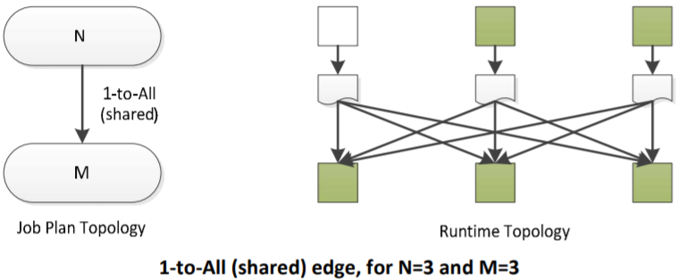
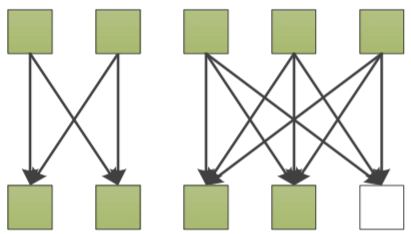
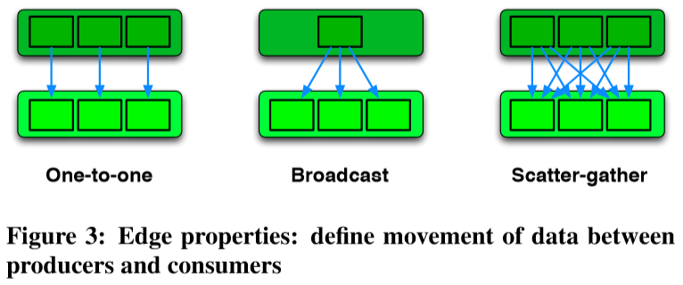
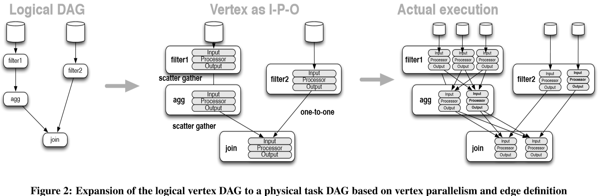
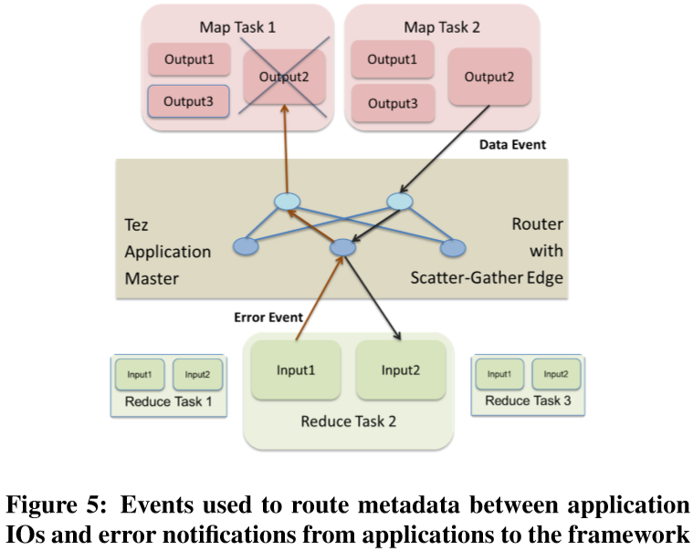
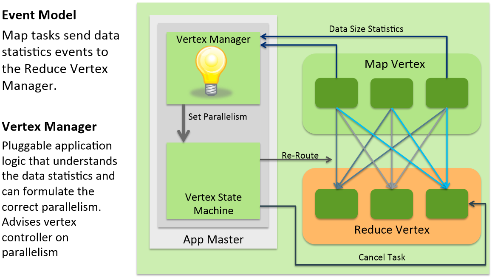
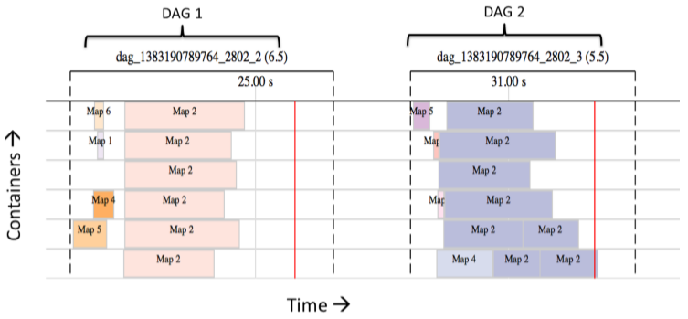

# Tez Design

Tez is a new application framework built on Hadoop Yarn that can execute complex directed acyclic graphs of general data processing tasks. In many ways it can be thought of as a more flexible and powerful successor of the map-reduce framework.


In the above figure Tez is represented by the red components: client-side API, an AppMaster, and multiple
containers that execute child processes under the control of the AppMaster. The purple components represent
either a second Tez job, an unrelated map-reduce job, or some other runtime that layers on YARN

As far as YARN is concerned, the Containers allocated to a Tez job are all equivalent and are opaque. The Tez
AppMaster takes full responsibility to use the containers to implement an effective job runtime. To do this the Tez
AppMaster manages a rich state machine that tracks all the inputs of a job through all processing stages until all
outputs are produced. The Tez AppMaster is responsible for dealing with transient container execution failures
and must respond to RM requests regarding allocated and possibly deallocated Containers

The Tez AppMaster is a single point of failure for a given job but given that many AppMasters can be executing on
a YARN cluster the cost of AppMaster failure is largely mitigated by design. Check-pointing or similar techniques
could be used to enable AppMaster restart should the cost of AppMaster failure be too great

Three separate software stacks are involved in the execution of a Tez job, each using components from the clientapplication, Tez, and YARN:


The application can be involved in the Job Management by providing an “application dynamic planning” module
that will be accessed by the AppMaster. Because the AppMaster is not running on a special node nor running with
privileged security access, security and system robustness are not compromised by running arbitrary application
code in the AppMaster

---

# High level Feature Set

The general charter for Tez is to create an execution runtime that can support the DAG-style execution plans
needed for Hive and Pig. The usefulness of DAG plans to relational query processing is well known and has been
explored in research and mission-critical systems (various SQL engines, Dryad, etc.). The flexibility of DAG-style
execution plans makes them useful for various data processing tasks such as iterative batch computing

Ad-hoc execution plans may involve various stages of processing such as transformation of two input sets, perhaps
with some aggregation, then a join between the inputs. When this type of plan is implemented via map-reduce
primitives, there are an inevitable number of job boundaries which introduce overheads of read/write to durable
storage and job startup, and which may miss out on easy optimization opportunities such as worker node reuse
and warm caches


Another issue with Map-Reduce is that it mandates a local sort of the output from each Map task. When the sort
is required it is very convenient to have the runtime take care of it but when it is not required it is an unnecessary
overhead. Tez increases the flexibility of task behaviors by eliminating mandatory behaviors

## Simple Tez query shapes

Hive can immediately benefit from the introduction of a few simple query plans

**MRR***

Transformations of a single data set may involve multiple shuffles. For example a groupby–orderby query

```SQL
explain select org_id, count(*) as c from t_store_daily_his where his_dt = '2019-06-01' group by org_id order by c;

+---------------------------------------------------------------------------------------------------------------+--+
|                                                    Explain                                                    |
+---------------------------------------------------------------------------------------------------------------+--+
| STAGE DEPENDENCIES:                                                                                           |
|   Stage-1 is a root stage                                                                                     |
|   Stage-2 depends on stages: Stage-1                                                                          |
|   Stage-0 depends on stages: Stage-2                                                                          |
|                                                                                                               |
| STAGE PLANS:                                                                                                  |
|   Stage: Stage-1                                                                                              |
|     Map Reduce                                                                                                |
|       Map Operator Tree:                                                                                      |
|           TableScan                                                                                           |
|             alias: t_store_daily_his                                                                          |
|             Statistics: Num rows: 1848234 Data size: 66536424 Basic stats: COMPLETE Column stats: NONE        |
|             Select Operator                                                                                   |
|               expressions: org_id (type: string)                                                              |
|               outputColumnNames: org_id                                                                       |
|               Statistics: Num rows: 1848234 Data size: 66536424 Basic stats: COMPLETE Column stats: NONE      |
|               Group By Operator                                                                               |
|                 aggregations: count()                                                                         |
|                 keys: org_id (type: string)                                                                   |
|                 mode: hash                                                                                    |
|                 outputColumnNames: _col0, _col1                                                               |
|                 Statistics: Num rows: 1848234 Data size: 66536424 Basic stats: COMPLETE Column stats: NONE    |
|                 Reduce Output Operator                                                                        |
|                   key expressions: _col0 (type: string)                                                       |
|                   sort order: +                                                                               |
|                   Map-reduce partition columns: _col0 (type: string)                                          |
|                   Statistics: Num rows: 1848234 Data size: 66536424 Basic stats: COMPLETE Column stats: NONE  |
|                   value expressions: _col1 (type: bigint)                                                     |
|       Reduce Operator Tree:                                                                                   |
|         Group By Operator                                                                                     |
|           aggregations: count(VALUE._col0)                                                                    |
|           keys: KEY._col0 (type: string)                                                                      |
|           mode: mergepartial                                                                                  |
|           outputColumnNames: _col0, _col1                                                                     |
|           Statistics: Num rows: 924117 Data size: 33268212 Basic stats: COMPLETE Column stats: NONE           |
|           File Output Operator                                                                                |
|             compressed: true                                                                                  |
|             table:                                                                                            |
|                 input format: org.apache.hadoop.mapred.SequenceFileInputFormat                                |
|                 output format: org.apache.hadoop.hive.ql.io.HiveSequenceFileOutputFormat                      |
|                 serde: org.apache.hadoop.hive.serde2.lazybinary.LazyBinarySerDe                               |
|                                                                                                               |
|   Stage: Stage-2                                                                                              |
|     Map Reduce                                                                                                |
|       Map Operator Tree:                                                                                      |
|           TableScan                                                                                           |
|             Reduce Output Operator                                                                            |
|               key expressions: _col1 (type: bigint)                                                           |
|               sort order: +                                                                                   |
|               Statistics: Num rows: 924117 Data size: 33268212 Basic stats: COMPLETE Column stats: NONE       |
|               value expressions: _col0 (type: string)                                                         |
|       Reduce Operator Tree:                                                                                   |
|         Select Operator                                                                                       |
|           expressions: VALUE._col0 (type: string), KEY.reducesinkkey0 (type: bigint)                          |
|           outputColumnNames: _col0, _col1                                                                     |
|           Statistics: Num rows: 924117 Data size: 33268212 Basic stats: COMPLETE Column stats: NONE           |
|           File Output Operator                                                                                |
|             compressed: true                                                                                  |
|             Statistics: Num rows: 924117 Data size: 33268212 Basic stats: COMPLETE Column stats: NONE         |
|             table:                                                                                            |
|                 input format: org.apache.hadoop.mapred.SequenceFileInputFormat                                |
|                 output format: org.apache.hadoop.hive.ql.io.HiveSequenceFileOutputFormat                      |
|                 serde: org.apache.hadoop.hive.serde2.lazy.LazySimpleSerDe                                     |
|                                                                                                               |
|   Stage: Stage-0                                                                                              |
|     Fetch Operator                                                                                            |
|       limit: -1                                                                                               |
|       Processor Tree:                                                                                         |
|         ListSink                                                                                              |
|                                                                                                               |
+---------------------------------------------------------------------------------------------------------------+--+

set hive.execution.engine=tez;
explain select org_id, count(*) as c from t_store_daily_his where his_dt = '2019-06-01' group by org_id order by c;

+--------------------------------------------------------------------------------------------------------+--+
|                                                Explain                                                 |
+--------------------------------------------------------------------------------------------------------+--+
| Plan optimized by CBO.                                                                                 |
|                                                                                                        |
| Vertex dependency in root stage                                                                        |
| Reducer 2 <- Map 1 (SIMPLE_EDGE)                                                                       |
| Reducer 3 <- Reducer 2 (SIMPLE_EDGE)                                                                   |
|                                                                                                        |
| Stage-0                                                                                                |
|   Fetch Operator                                                                                       |
|     limit:-1                                                                                           |
|     Stage-1                                                                                            |
|       Reducer 3                                                                                        |
|       File Output Operator [FS_9]                                                                      |
|         Select Operator [SEL_8] (rows=924117 width=36)                                                 |
|           Output:["_col0","_col1"]                                                                     |
|         <-Reducer 2 [SIMPLE_EDGE]                                                                      |
|           SHUFFLE [RS_7]                                                                               |
|             Group By Operator [GBY_5] (rows=924117 width=36)                                           |
|               Output:["_col0","_col1"],aggregations:["count(VALUE._col0)"],keys:KEY._col0              |
|             <-Map 1 [SIMPLE_EDGE]                                                                      |
|               SHUFFLE [RS_4]                                                                           |
|                 PartitionCols:_col0                                                                    |
|                 Group By Operator [GBY_3] (rows=1848234 width=36)                                      |
|                   Output:["_col0","_col1"],aggregations:["count()"],keys:org_id                        |
|                   Select Operator [SEL_2] (rows=1848234 width=36)                                      |
|                     Output:["org_id"]                                                                  |
|                     TableScan [TS_0] (rows=1848234 width=36)                                           |
|                       dwd@t_store_daily_his,t_store_daily_his,Tbl:COMPLETE,Col:NONE,Output:["org_id"]  |
|                                                                                                        |
+--------------------------------------------------------------------------------------------------------+--+

```

The map-reduce execution plan produced by Hive-0.9.0 and executed by Map-Reduce/Hadoop-1.x comprises two
distinct map-reduce jobs

A better execution plan can be implemented by structuring a Map-Reduce-Reduce job


## Join

Joins can be implemented using the map-reduce primitive but it is not a natural fit. The requirement that the
primary input to map-reduce is a single homogeneous dataset is a frustration that must be worked around. The
most general implementation is a reduce-side-join which introduces inefficiency by augmenting each true input
row with an “input identifier” and writing the entire augmented inputs back to durable storage. Map-side joins
either require precisely bucketed inputs or that one dataset be small and passed via a side-channel such as the
Hadoop distributed cache

A DAG execution plan can make use of multiple distinct input sets such that augmenting each input row is not
necessary. There is no need to read/write to durable storage and various implementations for join can be
naturally represented

The most straightforward case is when two or more data sets are already hash-partitioned on the same key and
with the same partition-count. Join can be implemented in this case by a job with DAG with a single vertex that
takes two data sets as input, connected with 1-to-1 edges. At runtime, one partition from each data set is passed
to each Task

The diagram below illustrates the plan and runtime behavior for a Join on two inputs that each are hashpartitioned on the Join key. Each data set comprises three partitions


*There are many other scenarios for Join that may be implemented using a variety of techniques and DAG
structures. A complete discussion is beyond the scope of this document*

---

# DAG topologies and scenarios

There are various DAG topologies and associated dynamic strategies that aid efficient execution of jobs. A
comprehensive nomenclature and encompassing framework is not yet established, however we can describe
various topologies and scenarios of interest

The following terminology is used:

- Job Vertex: A "stage" in the job plan.
- Job Edge: The logical connections between Job Vertices.
- Vertex: A materialized stage at runtime comprising a certain number of materialized tasks
- Edge: Represents actual data movement between tasks.
- Task: A process performing computation within a YARN container
- Task cardinality: The number of materialized tasks in a Vertex.
- Static plan: Planning decisions fixed before job submission
- Dynamic plan: Planning decisions made at runtime in the AppMaster process

In terms of responsibilities, the client application is responsible for the total logical outcome of the job whereas
Tez is responsible for physical behavior. For example, Tez has no notion of hash-partitioning, rather it only knows
about vertices, their connections and how to move data between them. It is the client's responsibility to ensure
data semantics are correctly observed

## Tez 1-to-1 edge

A basic connection between job vertices that indication each Task in first stage has a 1:1 connection to Tasks in
subsequent stage.

This type of edge appears in a variety of scenarios such as in the hash-Join plan discussed earlier. Job composition
may also lead to graphs with 1-to-1 edges


## 1-to-All

A 1-to-All edge indicates that each source task will produce data that is read by all of the destination tasks. There
are a variety of ways to make this happen and so a 1-to-All edge may have properties describing its exact behavior.
Two important variants are described below

### 1-to-All (basic)

In a graph of two job vertices having cardinality N and M, a basic 1-to-All edge has each task produce M outputs,
one for each of the M destination tasks. Each destination task receives one input from each of the source tasks.
This shape is also known as **complete bipartite**


The primary point to note is that the tasks in the first vertex **must open M output targets** and write to them
individually. If implemented with real files or network ports this may not scale to support thousands of destination
tasks

### 1-to-All (shared)

A "1-to-All shared" edge has each task produce one output file and that file is made available to all the destination
tasks. The primary use of this edge is to implement hash-partitioning **without the need** to open many outputs per
task that would **be required with the basic 1-to-All edge**. The strategy is to have each source task produce a single
output file that comprises a packed and indexed representation of M partitions. The destination tasks receive an
identifier for each output, read the index, then only transfer their portion of the output



## Dynamic Task Cardinality

For relational query processing it is frequently necessary to support runtime decisions for task-cardinality. Some
scenarios include

- A standard container might be known to handle X bytes of data without suffering OOM or taking
excessively long. At runtime, each stage should create sufficient tasks such that each receives no more
than X bytes of input

- A job hint might specify resource usage guidelines such as "Use as few resources as required to make
progress" or "Use as many cluster resources as makes sense"

- Dynamic decision making may also involve how to schedule tasks against available container slots. If
there are N files requiring processing but only M slots available, we have choices:
  - run M tasks, and provide groups of files to each
  - run N tasks but only activate M at a time
  - file-sized based dynamic decisions

Tez expects to supports these types of data-size constraints as needed by adopters

## Skew Handling

Data skew is an ever present issue for relational queries as it routinely leads to a vertex in which the tasks have
unequal data sizes to process. Various strategies such as over-partitioning and dynamic task cardinality are useful
to resolve data-skew situations

A particular cause of concern is a data-skew in which a large portion of rows share a common key. For example, if
a key column contains many NULLs, or perhaps simply a frequent value such as "en-US", then a hash-partitioning
operation may yield very uneven buckets

Higher performance solutions may require runtime support. For example the runtime may allow a graph such as
the following to be materialized



Such a topology could be useful if the data was known to be separable into a problematic set and an easy set. The
problematic set would receive more resources (i.e. more Tasks and Containers) and perhaps different task logic

Tez can be extended to support advanced topologies as necessary


---

# Tez API

The Tez API comprises many services that support applications to run DAG-style jobs.  An application that makes use of Tez will need to:

  1. Create a job plan (the DAG) comprising vertices, edges, and data source references
  2. Create task implementations that perform computations and interact with the DAG AppMaster
  3. Configure Yarn and Tez appropriately

A concrete example of a Tez adopter is the Tez Map-Reduce implementation.  See the following for pointers

  - org.apache.tez.mapreduce.YarnRunner
  - org.apache.tez.mapreduce.processor.MRTask
  - org.apache.tez.mapreduce.processor.map.MapProcessor
  - org.apache.tez.mapreduce.processor.reduce.ReduceProcessor

## DAG definition API

Directed Acyclic Graph representing the structure of a data processing workflow. Data flows in the direction of the edges

The Tez DAG API is exposed to runtime engine builders as an expressive way to capture the structure of their computation in a concise way. The class of data processing application we focus on, are naturally represented as DAGs, where data proceeds from data sources towards data sinks, while being transformed in intermediate vertices. Modeling computations as aDAGisnotnewbuthithertomostsystemshavetypicallydesigned DAG APIs in the context of supporting a higher level engine. Tez is designed to model this data flow graph as the main focus. Using well-knownconceptsofverticesandedgestheDAGAPIenablesa clear and concise description of the structure of the computation

The Tez DAG API is not involved in data semantics, rather it is only concerned with data movement.  Tez jobs are specified via calls to the DAG API to set up the job structure, register which classes will be used during task execution and so on.

### org.apache.hadoop.yarn.api.records  (defined in YARN codebase)

```java
public abstract class Resource {
  void setMemory(int);     
  void setVirtualCores(int);
  int getMemory();
  int getVirtualCores();
}
```

### org.apache.Tez.dag.api.DAG

```java
public class DAG {

  public static DAG create(String name) {
    return new DAG(name);
  }

  public synchronized DAG addVertex(Vertex vertex) {
    if (vertices.containsKey(vertex.getName())) {
      throw new IllegalStateException(
        "Vertex " + vertex.getName() + " already defined!");
    }
    vertices.put(vertex.getName(), vertex);
    return this;
  }

  public synchronized Vertex getVertex(String vertexName) {
    return vertices.get(vertexName);
  }

  public synchronized DAG addEdge(Edge edge) {
    if (!vertices.containsValue(edge.getInputVertex())) {
      throw new IllegalArgumentException(
        "Input vertex " + edge.getInputVertex() + " doesn't exist!");
    }
    if (!vertices.containsValue(edge.getOutputVertex())) {
      throw new IllegalArgumentException(
        "Output vertex " + edge.getOutputVertex() + " doesn't exist!");
    }
    if (edges.contains(edge)) {
      throw new IllegalArgumentException(
        "Edge " + edge + " already defined!");
    }

    // inform the vertices
    edge.getInputVertex().addOutputVertex(edge.getOutputVertex(), edge);
    edge.getOutputVertex().addInputVertex(edge.getInputVertex(), edge);

    edges.add(edge);
    return this;
  }

  public DAG setConf(String property, String value) {
    TezConfiguration.validateProperty(property, Scope.DAG);
    dagConf.put(property, value);
    return this;
  }

  public String getName() {
    return this.name;
  }

  public synchronized DAGPlan createDag(Configuration tezConf, Credentials extraCredentials,
      Map<String, LocalResource> tezJarResources, LocalResource binaryConfig,
      boolean tezLrsAsArchive, ServicePluginsDescriptor servicePluginsDescriptor,
      JavaOptsChecker javaOptsChecker) {
        ...
      }
}
```

### org.apache.tez.dag.api.Vertex

A vertex in the DAG API represents transformation of data and is one of the steps in processing the data. This is where the core application logic gets applied to the data. Hence a vertex must be configured with a user-provided processor class that defines the logic to be executed in each task. One 'vertex' in the DAG is often executed in parallel across a (possibly massive) number of parallel tasks. The definition of a vertex controls such parallelism. Parallelism is usually determined by the need to process data that is distributed across machines or by the need to divide a large operation into smaller pieces. The task parallelism of a vertex maybe defined statically during DAG definition but is typically determined dynamically at runtime.

```java
public class Vertex {

  public static Vertex create(String vertexName,
                               ProcessorDescriptor processorDescriptor,
                               int parallelism,
                               Resource taskResource) {
    return new Vertex(vertexName, processorDescriptor, parallelism, taskResource);
  }

  void setTaskResource(Resource resource) {
    this.taskResource = resource;
  }

  /**
   * Specifies an external data source for a Vertex. This is meant to be used
   * when a Vertex reads Input directly from an external source </p>
   *
   * For vertices which read data generated by another vertex - use the
   * {@link DAG addEdge} method.
   *
   * If a vertex needs to use data generated by another vertex in the DAG and
   * also from an external source, a combination of this API and the DAG.addEdge
   * API can be used. </p>
   *
   * Note: If more than one RootInput exists on a vertex, which generates events
   * which need to be routed, or generates information to set parallelism, a
   * custom vertex manager should be setup to handle this. Not using a custom
   * vertex manager for such a scenario will lead to a runtime failure.
   *
   * @param inputName
   *          the name of the input. This will be used when accessing the input
   *          in the {@link LogicalIOProcessor}
   * @param dataSourceDescriptor
   *          the @{link DataSourceDescriptor} for this input.
   * @return this Vertex
   */
  public Vertex addDataSource(String inputName, DataSourceDescriptor dataSourceDescriptor) {
    Preconditions.checkArgument(StringUtils.isNotBlank(inputName),
        "InputName should not be null, empty or white space only, inputName=" + inputName);
    Preconditions.checkArgument(!additionalInputs.containsKey(inputName),
        "Duplicated input:" + inputName + ", vertexName=" + vertexName);
    additionalInputs
        .put(inputName, new RootInputLeafOutput<InputDescriptor, InputInitializerDescriptor>(
            inputName, dataSourceDescriptor.getInputDescriptor(),
            dataSourceDescriptor.getInputInitializerDescriptor()));
    this.dataSources.add(dataSourceDescriptor);
    return this;
  }

  /**
   * Specifies an external data sink for a Vertex. This is meant to be used when
   * a Vertex writes Output directly to an external destination. </p>
   *
   * If an output of the vertex is meant to be consumed by another Vertex in the
   * DAG - use the {@link DAG addEdge} method.
   *
   * If a vertex needs generate data to an external source as well as for
   * another Vertex in the DAG, a combination of this API and the DAG.addEdge
   * API can be used.
   *
   * @param outputName
   *          the name of the output. This will be used when accessing the
   *          output in the {@link LogicalIOProcessor}
   * @param dataSinkDescriptor
   *          the {@link DataSinkDescriptor} for this output
   * @return this Vertex
   */
  public Vertex addDataSink(String outputName, DataSinkDescriptor dataSinkDescriptor) {
    Preconditions.checkArgument(StringUtils.isNotBlank(outputName),
        "OutputName should not be null, empty or white space only, outputName=" + outputName);
    Preconditions.checkArgument(!additionalOutputs.containsKey(outputName),
        "Duplicated output:" + outputName + ", vertexName=" + vertexName);
    additionalOutputs
        .put(outputName, new RootInputLeafOutput<OutputDescriptor, OutputCommitterDescriptor>(
            outputName, dataSinkDescriptor.getOutputDescriptor(),
            dataSinkDescriptor.getOutputCommitterDescriptor()));
    this.dataSinks.add(dataSinkDescriptor);
    return this;
  }

  public Vertex setLocationHint(VertexLocationHint locationHint) {
    List<TaskLocationHint> locations = locationHint.getTaskLocationHints();
    if (locations == null) {
      return this;
    }
    Preconditions.checkArgument((locations.size() == parallelism),
        "Locations array length must match the parallelism set for the vertex");
    this.locationHint = locationHint;
    return this;
  }

  public Vertex setTaskLaunchCmdOpts(String cmdOpts){
     this.taskLaunchCmdOpts = cmdOpts;
     return this;
  }

  VertexLocationHint getLocationHint() {
    return locationHint;
  }

  public String getTaskLaunchCmdOpts(){
	  return taskLaunchCmdOpts;
  }

}

public class VertexLocationHint {

  private final List<TaskLocationHint> taskLocationHints;

  public static VertexLocationHint create(
      List<TaskLocationHint> taskLocationHints) {
    return new VertexLocationHint(taskLocationHints);
  }

  public List<TaskLocationHint> getTaskLocationHints() {
    return taskLocationHints;
  }

}


public class TaskLocationHint {

  public static TaskLocationHint createTaskLocationHint(String vertexName, int taskIndex) {
    return new TaskLocationHint(vertexName, taskIndex);
  }

  public static TaskLocationHint createTaskLocationHint(Set<String> hosts, Set<String> racks) {
    return new TaskLocationHint(hosts, racks);
  }

  public Set<String> getHosts() {
    return hosts;
  }

  public Set<String> getRacks() {
    return racks;
  }

}

public class ProcessorDescriptor extends EntityDescriptor<ProcessorDescriptor> {

  @Private // for Writable
  public ProcessorDescriptor() {
    super();
  }

  private ProcessorDescriptor(String processorClassName) {
    super(processorClassName);
  }

  public static ProcessorDescriptor create(String processorClassName) {
    return new ProcessorDescriptor(processorClassName);
  }
}
```

### org.apache.tez.dag.api.Edge

An edge in the graph represents the logical and physical aspects of data movement between producer andconsumer vertices.

```java
public class Edge{

  public static Edge create(Vertex inputVertex,
                            Vertex outputVertex,
                            EdgeProperty edgeProperty) {
    return new Edge(inputVertex, outputVertex, edgeProperty);
  }

  public Vertex getInputVertex() {
    return inputVertex;
  }

  public Vertex getOutputVertex() {
    return outputVertex;
  }

  public EdgeProperty getEdgeProperty() {
    return edgeProperty;
  }

  public String getId() {
    // ensure it is unique.
    return String.valueOf(System.identityHashCode(this));
  }

}
```

### org.apache.tez.dag.api.EdgeProperty

Edge properties define the connection between producer and consumer tasks in the DAG:

  - **ConnectionPattern(Data movement) - Defines routing of data between tasks:** The logical aspect of anedge is the connection pattern between producer and consumer vertex tasks andtheirschedulingdependency. Thisenablestheorchestration framework to route data from the output of the producer task to the correct input of the consumer task. This routing table must be specified by implementing a pluggable EdgeManagerPlugin API. Figure 3 shows 3 common connection patterns (one-to-one, broadcast, scatter-gather), that can be used to express most DAG connections and come built-in with the project. For cases where custom routing is needed, applications are allowed to define their own routing by providing their own implementation

  

    - 第i个producer产生的数据，发送给第i个consumer。这种上下游关系属于Spark的窄依赖
    - Broadcast: producer产生的数据路由都下游所有consumer。这种上下游关系也属于Spark的窄依赖
    - Scatter-Gather: producer将产生的数据分块，将第i块数据发送到第i个consumer。这种上下游关系属于Spark的宽依赖

  - **Scheduling :** define when a consumer task is scheduled
    - Sequential: consumer task may be scheduled after a producer task completes.
    - Concurrent: consumer task must be co-scheduled with producer task

  - **Data Source :** define the lifetime/reliability of a task output
    - Persisted: 当任务退出后，该任务output依然存在，但经过一段时间后，可能会被删除，如：Mapper输出的中间结果
    - Persisted-Reliable: 任务output总是存在，比如，MR中reducer的输出结果，存在HDFS上。
    - Ephemeral: 任务输出只有当该task在运行的时候，才存在，如：流计算的中间结果

```java
public class EdgeProperty {


  /**
   * Defines the manner of data movement between source and destination tasks.
   * Determines which destination tasks have access to data produced on this
   * edge by a source task. A destination task may choose to read any portion of
   * the data available to it.
   */
  public enum DataMovementType {
    /**
     * Output on this edge produced by the i-th source task is available to the
     * i-th destination task.
     */
    ONE_TO_ONE,
    /**
     * Output on this edge produced by any source task is available to all
     * destination tasks.
     */
    BROADCAST,
    /**
     * The i-th output on this edge produced by all source tasks is available to
     * the same destination task. Source tasks scatter their outputs and they
     * are gathered by designated destination tasks.
     */
    SCATTER_GATHER,

    /**
     * Custom routing defined by the user.
     */
    CUSTOM
  }

  /**
   * Determines the lifetime of the data produced on this edge by a source task.
   */
  public enum DataSourceType {
    /**
     * Data produced by the source is persisted and available even when the
     * task is not running. The data may become unavailable and may cause the
     * source task to be re-executed.
     */
    PERSISTED,
    /**
     * Source data is stored reliably and will always be available. This is not supported yet.
     */
    @Unstable
    PERSISTED_RELIABLE,
    /**
     * Data produced by the source task is available only while the source task
     * is running. This requires the destination task to run concurrently with
     * the source task. Development in progress.
     */
    @Unstable
    EPHEMERAL
  }

  /**
   * Determines when the destination task is eligible to run, once the source
   * task is eligible to run.
   */
  public enum SchedulingType {
    /**
     * Destination task is eligible to run after one or more of its source tasks
     * have started or completed.
     */
    SEQUENTIAL,
    /**
     * Destination task must run concurrently with the source task.
     * Development in progress.
     */
    @Unstable
    CONCURRENT
  }

  /**
   * Determines the relevant event(s) that will assist in scheduling downstream vertex
   * connected via a edge with CONCURRENT {@link SchedulingType}.
   */
  public enum ConcurrentEdgeTriggerType {
    /**
     * trigger tasks scheduling for downstream vertex(es) upon upstream being configured
     * this effectively simultaneously schedules downstream and upstream vertices
     * connected on both ends of a concurrent edge.
     */
    SOURCE_VERTEX_CONFIGURED,

    /**
     * trigger tasks scheduling for downstream vertex(es) by "running" event(s) of upstream tasks
     * this will be fully supported with TEZ-3999
     */
    SOURCE_TASK_STARTED
  }

  public static EdgeProperty create(DataMovementType dataMovementType,
                                    DataSourceType dataSourceType,
                                    SchedulingType schedulingType,
                                    OutputDescriptor edgeSource,
                                    InputDescriptor edgeDestination) {
    return new EdgeProperty(dataMovementType, dataSourceType, schedulingType, edgeSource,
        edgeDestination);
  }

  public static EdgeProperty create(EdgeManagerPluginDescriptor edgeManagerDescriptor,
                                    DataSourceType dataSourceType,
                                    SchedulingType schedulingType,
                                    OutputDescriptor edgeSource,
                                    InputDescriptor edgeDestination) {
    return new EdgeProperty(edgeManagerDescriptor, dataSourceType, schedulingType, edgeSource,
        edgeDestination);
  }

  public static EdgeProperty create(EdgeManagerPluginDescriptor edgeManagerDescriptor,
      DataMovementType dataMovementType, DataSourceType dataSourceType,
      SchedulingType schedulingType, OutputDescriptor edgeSource, InputDescriptor edgeDestination) {
    return new EdgeProperty(edgeManagerDescriptor, dataMovementType, dataSourceType,
        schedulingType, edgeSource, edgeDestination);
  }

}
```

### org.apache.tez.dag.api.OutputDescriptor

```java
public class OutputDescriptor extends EntityDescriptor<OutputDescriptor> {

  @Private // for Writable
  public OutputDescriptor() {
    super();
  }

  private OutputDescriptor(String outputClassName) {
    super(outputClassName);
  }

  public static OutputDescriptor create(String outputClassName) {
    return new OutputDescriptor(outputClassName);
  }
}
```

### org.apache.tez.dag.api.InputDescriptor

```java
public class InputDescriptor extends EntityDescriptor<InputDescriptor> {

  @Private // for Writable
  public InputDescriptor() {
    super();
  }

  private InputDescriptor(String inputClassName) {
    super(inputClassName);
  }

  public static InputDescriptor create(String inputClassName) {
    return new InputDescriptor(inputClassName);
  }
}
```

## Runtime APIs

The DAG API defines the scaffolding structure of the data processing. The Runtime API is used to inject the actual application code that fills the scaffolding. Concretely,the Runtime API defines the interfaces to be implemented to create processor,input and output classes that are specified in the DAG above



### Input/Processor/Output

A vertex is a logical representation of a transformation step in the DAG. The actual transformations are applied by running tasks, for that vertex, on machines in the cluster. Tez defines each task as a composition of a set of inputs, a processor and a set of outputs (IPO). The processor is defined by the vertex for that task. The inputs are defined by the output classes of the incoming edges to that vertex. The outputs by the input classes of the outgoing edges from that vertex. This enables the processor to have a logical view of the processing, thus retaining the simplified programming model popularized in MapReduce. The inputs and outputs hide details like the data transport,partitioning of data and/or aggregation of distributed shards. The Runtime API is a thin wrapper to instantiate and interact with inputs, processors and outputs. After the IPO objects have been created, they are configured.

### IPO Configuration

The framework configures IPOs via an opaque binary payload specified during DAG creation. This manner of binary payload configuration is a common theme to configure any application specific entity in Tez. This allows applications to instantiate their code using any mechanism of their choice. Not only can this be used for simple configuration but also for code injection (as exemplified in Section 5.4). After configuration, the processor is presented with all its inputs and outputs and asked to run. Thereafter, it's up to the processor, inputs and outputs to cooperate with each other to complete thetask. Theframework interacts with them via a context object to send and receive events about completion, update progress, report errors etc.

### Data Plane Agnostic

Tez specifies no data format and infact, is not part of the data plane during DAG execution. The actual data transfer is performed by the inputs and outputs with Tez only routing connection information between producers and consumers. When a producer task output generates data then it can send metadata about it, say its access URL and size,via Tez,to the consumer task input. Tez routes this metadata using the connection pattern encoded in the edge connecting the producer and consumer. Thus Tez adds minimal overhead on the data plane. This also makes Tez data format agnostic. The inputs,processor and output scan choose their own data formats (e.g. bytes, records or key-value pairs etc.) as suited for the application.

## Event Based Control Plane(事件驱动机制)

The open architecture of the Tez orchestration framework requires a de-coupled control plane that allows a variety of entities to communicate control information with each other. In order to achieve this Tez has an event based control plane that is also exposed to the application. Software components generate events that get routed to receivers. By design, this is an asynchronous, non-blocking, push-based method of communication. Events are used for all communications, be it framework to framework, application to framework and vice versa, or application to application. As shown in Figure 5, a DataEvent is generated by the output of a producer task and contains output metadata (say a URL) for the consumer task to read the data. This event is received by the framework and routed to the input of the consumer task by utilizing the connection information specified by the edge.

If a task input has an error while reading its data then it can send an ErrorEvent to the framework. Based on such error events, Tez could re-execute the producer task to re-generate the data. Other events could be used to send statistics, progress etc. Event based communication also provides the flexibility to add more entities and communication channels without changing the interaction model or APIs. Tez only routes the events. Each event has an opaque binary payload that is interpreted by the sender and receiver to exchange control metadata. Events flow to and from tasks to the orchestrator on every task heartbeat. Event transfer latency depends on the heartbeat latency and processing latency at the orchestrator. These latencies increase in proportion to the size of the job as they depend on the number of concurrent connections and event load supported by the orchestrator. If control plane events lie on the data plane critical path then they would negatively affect application latency but if they are used only for data plane setup then Tez would not introduce any additional latency on the data plane for low latency applications.




## VertexManager: dynamically adapting the execution

  - Change task concurrency
  - Change task scheduling
  - Change DAG edges
  - Change DAG vertces

As motivated earlier, data processing clusters have variability in compute capacity or data distribution(where data is stored on physical nodes) that applications may consider to plan their work. Data dependent actions like sample based range partitioning or optimizations like partition pruning need the ability to change the DAG on thefly. It is not possible to encode all such current and future graph re-configurations statically, nor can this be done by Tez itself (as it requires too much domain knowledge). Thus Tez needs to allow the application to make such decisions at runtime and coordinate with Tez to dynamically adapt the DAG and its execution. This is enabled via the `VertexManager` abstraction.

### Runtime Graph Re-configuration

When constructing the DAG, each vertex can be associated with a VertexManager. The VertexManager is responsible for vertex re-configuration during DAGexecution. The orchestration framework contains various state machines that control the life-cycle of vertices, tasks etc. and the vertex state machine is designed to interact with the VertexManager during state transitions. The VertexManager is provided a context object that notifies it about state changes like task completions etc. Using the context object, the VertexManager can make changes to its own vertex's state. Among other things, the VertexManager can control the vertex parallelism, the configuration payloads of the inputs, processors and outputs, the edge properties and scheduling of tasks. As with other entities there is a VertexManager API that can be implemented by applications to customize the vertex execution. Using the same API, Tez comes with some built-in VertexManagers. If a VertexManager is not specified in the DAG, then Tez will pick one of these built-in implementations based on the vertex characteristics.

### Automatic Partition Cardinality Estimation

As an example of a runtime optimization, we present a solution to a well known problem in MapReduce about determining the correct number of tasks in the reduce phase. This number typically depends on the size of the data being shuffled from the mappers to the reducers and is accurately available only at runtime. Shuffle is the term used to describe the cross-network read and aggregation of partitioned input done prior to invoking the reduce operation. InTez,the ShuffleVertexManager can be used to control the vertices that are reading shuffled data. The tasks producing the data to be shuffled, send data statistics to the ShuffleVertexManager using VertexManager events. As visualized in Figure 6, the ShuffleVertexManager gathers these statistics to calculate the total data size and estimate the correct number of reducers to read that data using a per-reducer desired data size heuristic. Since the number of reducers essentially represents thepartition cardinality, this solutioncan be generalized to estimating the optimal number of partitions at runtime (e.g. partitions participating in a distributed join operation)



## Data Source Initializer

In Tez we have modeled data sources as first class entities in our design. The first step in a DAG usually involves reading initial input from data sources like distributed file systems, and typically is the largest in terms of resource consumption. Hence,a good or bad decision at this step can significantly improve or degrade performance. A data source in a DAG can be associated with a DataSourceInitializer that is invoked by the framework before running tasks for the vertex reading that data source. The initializer has the opportunity to use accurate information available at runtime to determine how to optimally read the input. Like the VertexManager, the initializer can also send and receive events from other entities. It also has access to cluster information via its framework context object. Based on these and other sources of information, the initializer can configure the task inputs or notify the vertex manager aboutvertexre-configurations(E.g. theoptimalparallelismneeded to process the input).

As an example, we will present a Hive **dynamic partition pruning** use case. It often happens that a data source will be read and subsequently joined on some key. If the join key space is known then we could only read a subset of the data that is relevant to the join. Sometimes this metadata is only available at runtime after inspecting the data in a different sub-graph of the DAG. Hive uses InputInitializer events to send this metadata from tasks in the other vertices to the initializer of the datasource. The initializer uses that metadata to decide the relevant subset of data to read. This can lead to large performance gains depending on the join selectivity. The above discussion has been a broad overview of the architecture and features in Tez.

---

# Implementation in YARN


The Apache Tez project consists of 3 main parts:

  - API library: This provides the DAG and Runtime APIs and other client side libraries to build applications
  - Orchestration framework: This has been implemented as a YARN Application Master to execute the DAG in a Hadoop cluster via YARN.
  - Runtime library: This provides implementations of various inputs and outputs that can be used out of the box


## Typical Tez Application Lifecycle

A Tez based application is written using the API library by constructing the DAG representing the application logic. Typically, higher level applications like Apache Pig construct DAGs on the fly by encoding their native language constructs into Tez DAGs. Since Tez is designed to operate in Hadoop clusters we have provided implementations of inputs and outputs to standard storage services present in all Hadoop clusters - HDFS for reliable data storage and YARN Shuffle Service for temporary data storage.  Applications that use only these services, need to implement just their processors to get up and running.

  1. The DAG is then submitted to a YARN cluster using the Tez client library
  2. YARN launches the Tez Application Master to orchestrate the DAG execution.  The DAG executed by the AM is typically a logical DAG that describes the data flow graph. The AM expands this graph to incorporate task parallelism per vertex. It does this using the input initializers and vertex managers specified in the DAG.
  3. The AM then requests YARN for resources to run the tasks from different vertices. YARN responds in the form of containers.
  4. The AM launches tasks on these containers and routes control events.
  5. Tasks are typically executed in their dependency order and the DAG completes when all its tasks complete

## Execution efficiency

### Locality Aware Scheduling

Scheduling processing close to the data location is important for large-scale data-processing. Tez tries to run tasks close to their input data location.  Location may be specified statically during DAG creation but is typically determined at runtime.

### Speculation

Tez monitors task progress and tries to detects traggler tasks that may be running much slower than other tasks in the same vertex. Upon detecting such a task,a speculative attempt may be launched that runs in parallel with the original task and races it to completion. If the speculative attempt finishes first then it is successful in improving the completion time.

### Container Reuse

Recall that the Tez AM runs tasks in containers allocated to it by YARN. When a task completes, the AM has an option to return the container to YARN and ask for another container with different capabilities or locality. However, each container allocation cycle has overheads associated with resource negotiation from YARN as well as launching the container process. This overhead can be minimized by re-using the container to run other pending tasks that match the resource allocation and locality of that container. When there are no such matching tasks, the Tez AM releases the idle containers back to YARN in return for new resources with different capabilities. In the Java world,this reuse has the additional benefit of giving the JVM optimizer a longer time to observe and optimize the hot code paths leading to further performance benefits.

### Session

A session takes the concept of container reuse one step further. A Tez AM can be run in session mode in which it can run a sequence of DAGs submitted to it by the client. This allows tasks from multiple DAGs to reuse containers and leads to further efficiencies and performance gains. In addition, a session can be pre-warmed by requesting the AM to launch containers before the first DAG is ready to execute. These pre-warmed containers can execute some pre-determined code to allow JVM optimizations to kick in. This extends the benefits of container reuse to the first DAG that gets submitted to the session. Tez sessions also enable iterative processing to be performed efficiently. Each iteration can be represented as a new DAG and submitted to a shared session for efficient execution using pre-warmed session resources.



---

# org.apache.tez.dag.api.TezConfiguration

Property|Desc|Default
--|:--:|--:
tez.am.staging.scratch-data.auto-delete|If true then Tez will try to automatically delete temporary job artifacts that it creates within the specified staging dir. Does not affect any user data|true
**tez.am.shuffle.auxiliary-service.id**|Specifies the name of the shuffle auxiliary service|mapreduce_shuffle
tez.staging-dir|Specifies a directory where Tez can create temporary job artifacts.|/tmp/{user}/tez/staging
tez.am.mode.session|Execution mode for the Tez application. True implies session mode. If the client code is written according to best practices then the same code can execute in either mode based on this configuration. Session mode is more aggressive in reserving execution resources and is typically used for interactive applications where multiple DAGs are submitted in quick succession by the same user. For long running applications, one-off executions, batch jobs etc non-session mode is recommended. If session mode is enabled then container reuse is recommended.|false
tez.task.max.allowed.output.failures.fraction|Represents ratio of unique failed outputs / number of consumer tasks. When this condition or value mentioned in `tez.task.max.allowed.output.failures `is met, task would be declared as failed by AM|0.1
tez.task.max.allowed.output.failures|Represents maximum allowed unique failures after which a task would be declared as failed by AM. When this condition or the threshold mentioned in `tez.task.max.allowed.output.failures.fraction` is met, task would be relaunched by AM|10
tez.am.max.allowed.time-sec.for-read-error|Represents the maximum time in seconds for which a consumer attempt can report a read error against its producer attempt, after which the producer attempt will be re-run to re-generate the output|300
tez.am.launch.cluster-default.cmd-opts|Command line options which will be prepended to `tez.am.launch.cmd-opts` during the launch of the AppMaster process. This property will typically be configured to include default options meant to be used by all jobs in a cluster|-server -Djava.net.preferIPv4Stack=true -Dhadoop.metrics.log.level=WARN
tez.am.launch.cmd-opts|Command line options provided during the launch of the Tez AppMaster process. Its recommended to not set any Xmx or Xms in these launch opts so that Tez can determine them automatically|-XX:+PrintGCDetails -verbose:gc -XX:+PrintGCTimeStamps -XX:+UseNUMA -XX:+UseParallelGC
tez.task.launch.cluster-default.cmd-opts|Command line options which will be prepended to `tez.task.launch.cmd-opts` during the launch of Tez tasks.  This property will typically be configured to include default options meant to be used by all jobs in a cluster|-server -Djava.net.preferIPv4Stack=true -Dhadoop.metrics.log.level=WARN
tez.task.launch.cmd-opts|Command line options provided during the launch of Tez Task processes. Its recommended to not set any Xmx or Xms in these launch opts so that Tez can determine them automatically|-XX:+PrintGCDetails -verbose:gc -XX:+PrintGCTimeStamps -XX:+UseNUMA -XX:+UseParallelGC
tez.container.max.java.heap.fraction|Tez automatically determines the Xmx for the JVMs used to run Tez tasks and app masters. This feature is enabled if the user has not specified Xmx or Xms values in the launch command opts. Doing automatic Xmx calculation is preferred because Tez can determine the best value based on actual allocation of memory to tasks the cluster. The value if used as a fraction that is applied to the memory allocated Factor to size Xmx based on container memory size. Value should be greater than 0 and less than 1.Set this value to -1 to allow Tez to use different default max heap fraction for different container memory size. Current policy is to use 0.7 for container smaller than 4GB and use 0.8 for larger container.|0.8
**tez.am.launch.cluster-default.env**|Env settings will be merged with `tez.am.launch.env` during the launch of the AppMaster process. This property will typically be configured to include default system env meant to be used by all jobs in a cluster|(windows)PATH=%PATH%;%HADOOP_COMMON_HOME%\\bin (linux)LD_LIBRARY_PATH=$LD_LIBRARY_PATH:$HADOOP_COMMON_HOME/lib/native/
tez.am.launch.env|Env settings for the Tez AppMaster process. Should be specified as a comma-separated of key-value pairs where each pair is defined as KEY=VAL e.g. "LD_LIBRARY_PATH=.,USERNAME=foo" These take least precedence compared to other methods of setting env. These get added to the app master environment prior to launching it. This setting will prepend existing settings in the cluster default|(empty)
**tez.task.launch.cluster-default.env**|Env settings will be merged with `tez.task.launch.env` during the launch of the task process. This property will typically be configured to include default system env meant to be used by all jobs in a cluster|(windows)PATH=%PATH%;%HADOOP_COMMON_HOME%\bin (linux)LD_LIBRARY_PATH=$LD_LIBRARY_PATH:$HADOOP_COMMON_HOME/lib/native/
tez.task.launch.env|Env settings for the Tez Task processes. Should be specified as a comma-separated of key-value pairs where each pair is defined as KEY=VAL e.g. "LD_LIBRARY_PATH=.,USERNAME=foo" These take least precedence compared to other methods of setting env These get added to the task environment prior to launching it|(empty)
tez.am.speculation.enabled|Enable speculative execution of slower tasks. This can help reduce job latency when some tasks are running slower due bad/slow machines|false
tez.am.maxtaskfailures.per.node|Specifies the number of task failures on a node before the node is considered faulty.|10
tez.am.vertex.max-task-concurrency|The maximum number of attempts that can run concurrently for a given vertex. Setting <=0 implies no limit|-1
tez.am.task.max.failed.attempts|The maximum number of attempts that can fail for a particular task before the task is failed.This does not count killed attempts. Task failure results in DAG failure.|4
tez.am.task.reschedule.higher.priority|Specifies whether a re-scheduled attempt of a task, caused by previous failures gets higher priority|true
tez.am.node-blacklisting.enabled|Enabled blacklisting of nodes of nodes that are considered faulty. These nodes will not be used to execute tasks.|true
tez.am.node-unhealthy-reschedule-tasks|Enable task rescheduling for node updates. When enabled the task scheduler will reschedule task attempts that are associated with an unhealthy node to avoid potential data transfer errors from downstream tasks.|false
tez.am.dag.scheduler.class|The class to be used for DAG Scheduling|org.apache.tez.dag.app.dag.impl.DAGSchedulerNaturalOrder
tez.am.yarn.scheduler.class|The class to be used for the YARN task scheduler. Expert level setting.|org.apache.tez.dag.app.rm.YarnTaskSchedulerService
tez.am.resource.memory.mb|The amount of memory in MB to be used by the AppMaster|1024
tez.am.resource.cpu.vcores|The number of virtual cores to be used by the app master|1
tez.am.dag.cleanup.on.completion|Instructs AM to delete Dag directory upon completion|false
**tez.task.resource.memory.mb**|The amount of memory in MB to be used by tasks. This applies to all tasks across all vertices. Setting it to the same value for all tasks is helpful for container reuse and thus good for performance typically.|1024
**tez.task.resource.cpu.vcores**|The number of virtual cores to be used by tasks.|1
**tez.am.container.reuse.enabled**|Configuration to specify whether container should be reused across tasks. This improves performance by not incurring recurring launch overheads.|true
**tez.am.container.reuse.rack-fallback.enabled**|Whether to reuse containers for rack local tasks. Active only if reuse is enabled.|true
**tez.am.container.reuse.non-local-fallback.enabled**|Whether to reuse containers for non-local tasks. Active only if reuse is enabled. Turning this on can severely affect locality and can be bad for jobs with high data volume being read from the primary data sources.|false
**tez.am.container.reuse.new-containers.enabled**|Whether to reuse new containers that could not be immediately assigned to pending requests. If enabled then newly assigned containers that cannot be immediately allocated will be held for potential reuse as if it were a container that had just completed a task. If disabled then newly assigned containers that cannot be immediately allocated will be released. Active only if container reuse is enabled.|false
**tez.am.container.idle.release-timeout-min.millis**|The minimum amount of time to hold on to a container that is idle. Only active when reuse is enabled. Set to -1 to never release idle containers (not recommended).|5000(long)
**tez.am.container.idle.release-timeout-max.millis**|The maximum amount of time to hold on to a container if no task can be assigned to it immediately. Only active when reuse is enabled. The value must be +ve and >= `tez.am.container.idle.release-timeout-min.millis`. Containers will have an expire time set to a random value between `tez.am.container.idle.release-timeout-min.millis` && `tez.am.container.idle.release-timeout-max.millis`. This creates a graceful reduction in the amount of idle resources held|10000(long)
**tez.am.session.min.held-containers**|The minimum number of containers that will be held in session mode. Not active in non-session mode. Enables an idle session (not running any DAG) to hold on to a minimum number of containers to provide fast response times for the next DAG|0
**tez.session.client.timeout.secs**|Time (in seconds) to wait for AM to come up when trying to submit a DAG from the client. Only relevant in session mode. If the cluster is busy and cannot launch the AM then this timeout may be hit. In those case, using non-session mode is recommended if applicable. Otherwise increase the timeout (set to -1 for infinity. Not recommended)|120
**tez.session.am.dag.submit.timeout.secs**|Time (in seconds) for which the Tez AM should wait for a DAG to be submitted before shutting down. Only relevant in session mode. Any negative value will disable this check and allow the AM to hang around forever in idle mode.|300
**tez.queue.name**|The queue name for all jobs being submitted from a given client|(empty)

# org.apache.tez.runtime.library.api.TezRuntimeConfiguration

Property|Desc|Default
--|:--:|--:
tez.runtime.ifile.readahead|Configuration key to enable/disable IFile readahead.|true
tez.runtime.ifile.readahead.bytes|Configuration key to set the IFile readahead length in bytes.|4194304
tez.runtime.compress|compress data|false
tez.runtime.compress.codec|compress codec|(empty)
tez.runtime.shuffle.keep-alive.enabled|keepalive|false
tez.runtime.shuffle.keep-alive.max.connections|max http conns|20
tez.runtime.unordered.output.buffer.size-mb|the memory when the output does not need to be sorted(10% of hive.tez.container.size)|100
tez.runtime.shuffle.memory-to-memory.enable|men-to-mem shuffle|false
tez.runtime.report.partition.stats|Report partition statistics (e.g better scheduling in ShuffleVertexManager). TEZ-2496 This can be enabled/disabled at vertex level. `org.apache.tez.runtime.library.api.TezRuntimeConfiguration.ReportPartitionStats` defines the list of values that can be specified.|(empty)
tez.runtime.io.sort.mb|defines the size of the soft buffer when output is sorted(40% of hive.tez.container.size)|100

# Hive on Tez
Property|Desc|Default
--|:--:|--:
hive.tez.input.format|The default input format for Tez. Tez groups splits in the AM|org.apache.hadoop.hive.ql.io.HiveInputFormat
hive.tez.auto.reducer.parallelism|Turn on Tez' auto reducer parallelism feature. When enabled, Hive will still estimate data sizes and set parallelism estimates. Tez will sample source vertices' output sizes and adjust the estimates at runtime as necessary|false
hive.tez.container.size|Tez will spawn containers of the size of a mapper|-1
hive.tez.bucket.pruning|bucket pruning|false
hive.tez.container.max.java.heap.fraction|heap fraction|0.8
hive.tez.cpu.vcores|cpu core|-1
hive.tez.java.opts|opts|(empty)
hive.tez.exec.print.summary|print summary|false
hive.tez.log.level|The log level to use for tasks executing as part of the DAG. Used only if `hive.tez.java.opts` is used to configure Java options|INFO

---

# Future tasks

Future architecture-level capabilities that will be considered for inclusion

- Task execution preemption
- Task execution check-pointing
- AppMaster execution check-pointing
- Task reuse (multiple tasks run in one container instance)
- Application sessions (e.g. containers kept alive and reused between client jobs)
- Post-serialization caches and other data-movement optimizations.
