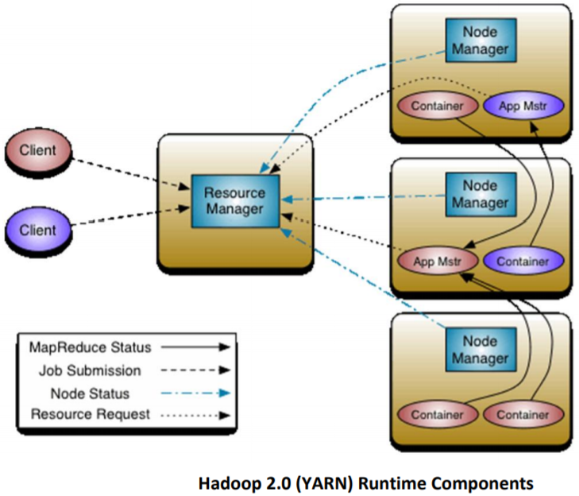
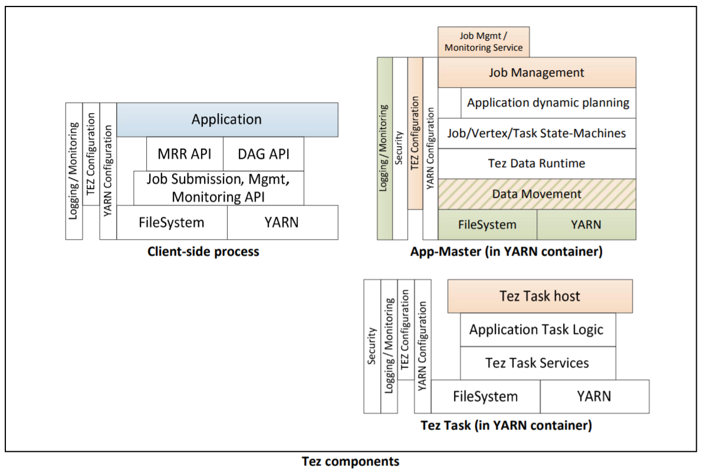
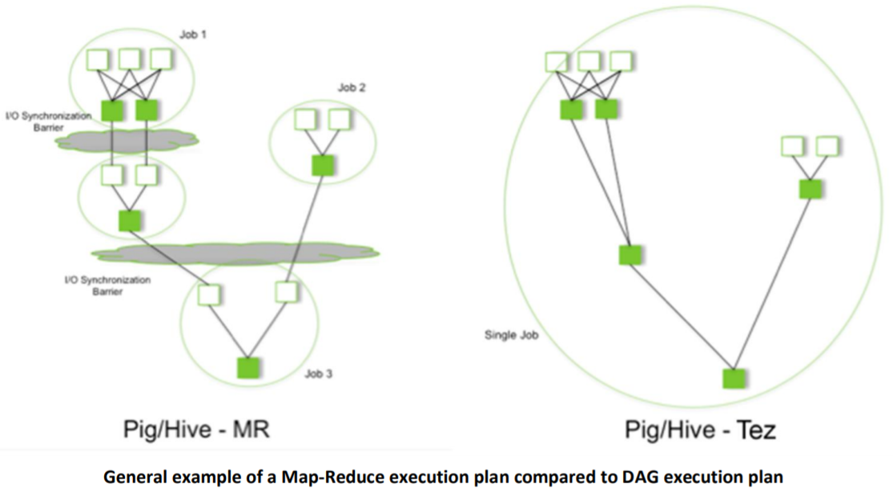
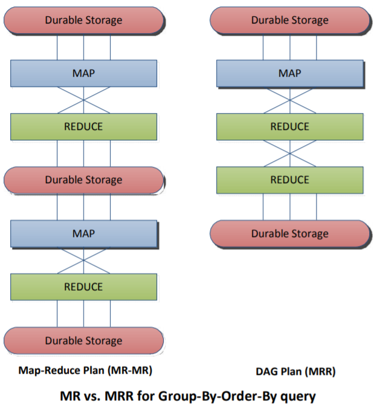
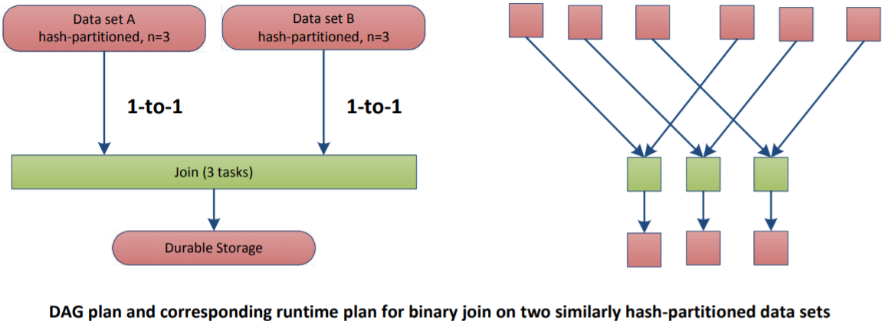
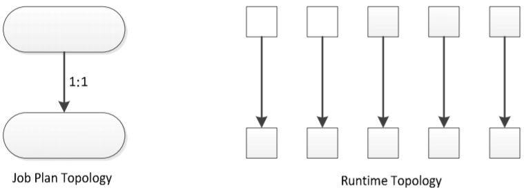
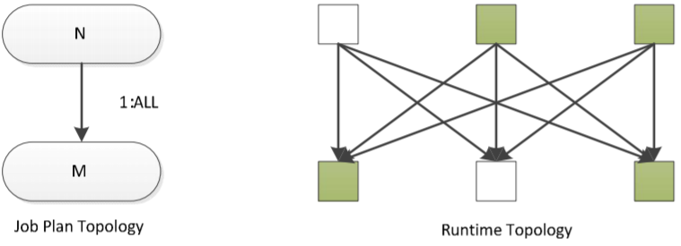

# Tez Design

Tez is a new application framework built on Hadoop Yarn that can execute complex directed acyclic graphs of general data processing tasks. In many ways it can be thought of as a more flexible and powerful successor of the map-reduce framework.



In the above figure Tez is represented by the red components: client-side API, an AppMaster, and multiple
containers that execute child processes under the control of the AppMaster. The purple components represent
either a second Tez job, an unrelated map-reduce job, or some other runtime that layers on YARN

As far as YARN is concerned, the Containers allocated to a Tez job are all equivalent and are opaque. The Tez
AppMaster takes full responsibility to use the containers to implement an effective job runtime. To do this the Tez
AppMaster manages a rich state machine that tracks all the inputs of a job through all processing stages until all
outputs are produced. The Tez AppMaster is responsible for dealing with transient container execution failures
and must respond to RM requests regarding allocated and possibly deallocated Containers

The Tez AppMaster is a single point of failure for a given job but given that many AppMasters can be executing on
a YARN cluster the cost of AppMaster failure is largely mitigated by design. Check-pointing or similar techniques
could be used to enable AppMaster restart should the cost of AppMaster failure be too great

Three separate software stacks are involved in the execution of a Tez job, each using components from the clientapplication, Tez, and YARN:



The application can be involved in the Job Management by providing an “application dynamic planning” module
that will be accessed by the AppMaster. Because the AppMaster is not running on a special node nor running with
privileged security access, security and system robustness are not compromised by running arbitrary application
code in the AppMaster

---

# High level Feature Set

The general charter for Tez is to create an execution runtime that can support the DAG-style execution plans
needed for Hive and Pig. The usefulness of DAG plans to relational query processing is well known and has been
explored in research and mission-critical systems (various SQL engines, Dryad, etc.). The flexibility of DAG-style
execution plans makes them useful for various data processing tasks such as iterative batch computing

Ad-hoc execution plans may involve various stages of processing such as transformation of two input sets, perhaps
with some aggregation, then a join between the inputs. When this type of plan is implemented via map-reduce
primitives, there are an inevitable number of job boundaries which introduce overheads of read/write to durable
storage and job startup, and which may miss out on easy optimization opportunities such as worker node reuse
and warm caches



Another issue with Map-Reduce is that it mandates a local sort of the output from each Map task. When the sort
is required it is very convenient to have the runtime take care of it but when it is not required it is an unnecessary
overhead. Tez increases the flexibility of task behaviors by eliminating mandatory behaviors

## Simple Tez query shapes

Hive can immediately benefit from the introduction of a few simple query plans

**MRR***

Transformations of a single data set may involve multiple shuffles. For example a groupby–orderby query

```SQL
-- select org_id, count(*) as c from t_store_daily_his where his_dt = '2019-06-01' group by org_id order by c

0: jdbc:hive2://emr-header-1:10000> explain select org_id, count(*) as c from t_store_daily_his where his_dt = '2019-06-01' group by org_id order by c;
+---------------------------------------------------------------------------------------------------------------+--+
|                                                    Explain                                                    |
+---------------------------------------------------------------------------------------------------------------+--+
| STAGE DEPENDENCIES:                                                                                           |
|   Stage-1 is a root stage                                                                                     |
|   Stage-2 depends on stages: Stage-1                                                                          |
|   Stage-0 depends on stages: Stage-2                                                                          |
|                                                                                                               |
| STAGE PLANS:                                                                                                  |
```

The map-reduce execution plan produced by Hive-0.9.0 and executed by Map-Reduce/Hadoop-1.x comprises two
distinct map-reduce jobs

A better execution plan can be implemented by structuring a Map-Reduce-Reduce job



## Join

Joins can be implemented using the map-reduce primitive but it is not a natural fit. The requirement that the
primary input to map-reduce is a single homogeneous dataset is a frustration that must be worked around. The
most general implementation is a reduce-side-join which introduces inefficiency by augmenting each true input
row with an “input identifier” and writing the entire augmented inputs back to durable storage. Map-side joins
either require precisely bucketed inputs or that one dataset be small and passed via a side-channel such as the
Hadoop distributed cache

A DAG execution plan can make use of multiple distinct input sets such that augmenting each input row is not
necessary. There is no need to read/write to durable storage and various implementations for join can be
naturally represented

The most straightforward case is when two or more data sets are already hash-partitioned on the same key and
with the same partition-count. Join can be implemented in this case by a job with DAG with a single vertex that
takes two data sets as input, connected with 1-to-1 edges. At runtime, one partition from each data set is passed
to each Task

The diagram below illustrates the plan and runtime behavior for a Join on two inputs that each are hashpartitioned on the Join key. Each data set comprises three partitions



*There are many other scenarios for Join that may be implemented using a variety of techniques and DAG
structures. A complete discussion is beyond the scope of this document*

## DAG topologies and scenarios

There are various DAG topologies and associated dynamic strategies that aid efficient execution of jobs. A
comprehensive nomenclature and encompassing framework is not yet established, however we can describe
various topologies and scenarios of interest

The following terminology is used:

- Job Vertex: A "stage" in the job plan.
- Job Edge: The logical connections between Job Vertices.
- Vertex: A materialized stage at runtime comprising a certain number of materialized tasks
- Edge: Represents actual data movement between tasks.
- Task: A process performing computation within a YARN container
- Task cardinality: The number of materialized tasks in a Vertex.
- Static plan: Planning decisions fixed before job submission
- Dynamic plan: Planning decisions made at runtime in the AppMaster process

In terms of responsibilities, the client application is responsible for the total logical outcome of the job whereas
Tez is responsible for physical behavior. For example, Tez has no notion of hash-partitioning, rather it only knows
about vertices, their connections and how to move data between them. It is the client's responsibility to ensure
data semantics are correctly observed

## Tez 1-to-1 edge

A basic connection between job vertices that indication each Task in first stage has a 1:1 connection to Tasks in
subsequent stage.

This type of edge appears in a variety of scenarios such as in the hash-Join plan discussed earlier. Job composition
may also lead to graphs with 1-to-1 edges



## 1-to-All

A 1-to-All edge indicates that each source task will produce data that is read by all of the destination tasks. There
are a variety of ways to make this happen and so a 1-to-All edge may have properties describing its exact behavior.
Two important variants are described below

### 1-to-All (basic)

In a graph of two job vertices having cardinality N and M, a basic 1-to-All edge has each task produce M outputs,
one for each of the M destination tasks. Each destination task receives one input from each of the source tasks.
This shape is also known as **complete bipartite**




---

# Future tasks

Future architecture-level capabilities that will be considered for inclusion

- Task execution preemption
- Task execution check-pointing
- AppMaster execution check-pointing
- Task reuse (multiple tasks run in one container instance)
- Application sessions (e.g. containers kept alive and reused between client jobs)
- Post-serialization caches and other data-movement optimizations.
